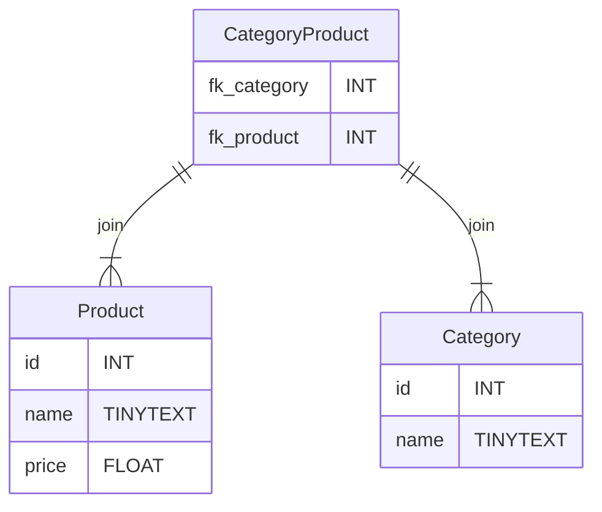

# Effectuer la requête `SELECT` pour une table de jointure.
Une fois que l'on a compris la liaison **Many to Many** et la nécessité d'une table de jointure, une question se pose.
*"Maintenant que les clés étrangères sont dans une troisième table, comment est ce que je vais pouvoir récupérer, par exemple, tous les produits d'une certaine catégorie ?"*

Nous devons récupérer les données d'une table A (Product) en fonction des données d'une autre table (CategoryProduct).

**La solution ?**

``INNER JOIN``

**Exemple Many to Many :**

Dans la table `Produit` nous avons :
```sql
SELECT * FROM `Product`;
```
|id|name|price|
|-|-|-|
1	|air max	                   |     100	
2	|Botte de ski taille 43	      |  150	
3	|puma sport 2022	          |      144	
4	|converse all stars taille 42|	60	
5	|UGG Femme taille 38	      |    130	

Dans la table `Category` nous avons :
```sql
SELECT * FROM `Category`;
```
|id|name|
|-|-|
|id	|name	
|1	|Sneakers	
|2	|Bottes	

Dans la table de jointure `CategoryProduct` :
```sql
> SELECT * FROM `CategoryProduct`;
```
|fk_category|fk_product|
|-|-|
|1	|1	
|2	|2	
|1	|3	
|1	|4	
|2	|5	
> `fk_category` : 1 représente les *sneakers*
> `fk_category` : 2 représente les *bottes*
## Solution :
Pour récupérer tout les produits qui ont pour catégorie *sneakers* (1) :
```sql
SELECT 
    name,
    price,
    CategoryProduct.fk_category as categoryId 
FROM Product 
INNER JOIN CategoryProduct ON
    CategoryProduct.fk_category = 1 
    AND 
    Product.id = CategoryProduct.fk_product;
```
Résultat :
|name|price|categoryId
|-|-|-|
|name	|price	|1
|air max	|100|1	
|puma sport 2022	|144	|1
|converse all stars taille 42	|60	|1

> `INNER JOIN` permet de sélectionner les colonnes de plusieurs tables et de filtrer les lignes grâce à `ON`. Dites vous que `ON` est un peu comme un `if` en programmation.

> INNER JOIN nous a permis de créer une condition qui utilise la table de jointure `CategoryProduct` et la table `Product`.

> **Méthode :**
> Quand vous devez récupérez des données et qu'une liaison `Many to Many` rentre en compte.
> 1. Commencez par `SELECT` la table qui vous intéresse :
>``` 
>SELECT ... FROM Product 
>```
>
>2. Puis filtrez les lignes avec `INNER JOIN` et le mot clé `ON` à la manière d'un `if` en programmation.
>```sql
>INNER JOIN CategoryProduct ON
>CategoryProduct.fk_category=1
>AND 
>Product.id=CategoryProduct.fk_product;
>```

## Pour aller plus loin
Pour aller plus loin, je peux même utiliser un alias et une requête imbriquée pour récupérer le nom de la catégorie dans la foulée et éviter de devoir envoyer plusieurs requêtes.
*Voir requête imbriquée : https://sql.sh/cours/sous-requete*
```sql
SELECT 
    name,
    price,
    (SELECT name FROM Category WHERE id = 1) as categoryName,
    CategoryProduct.fk_category as categoryId 
FROM Product 
INNER JOIN CategoryProduct ON 
    CategoryProduct.fk_category=1 
    AND 
    Product.id=CategoryProduct.fk_product; 
```