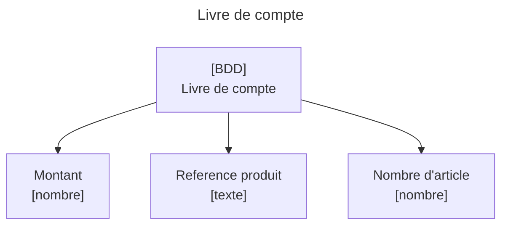
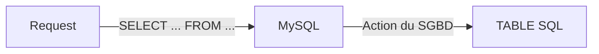
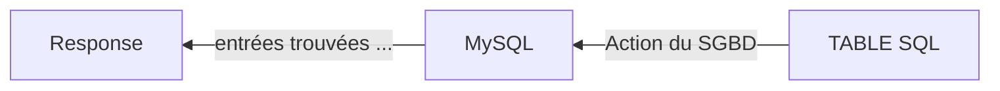

# SQL : Théorie et installation de MySQL
# Qu'est ce qu'une base de donnée ?
Une base de donnée (BDD) est un ensemble d'informations structurés. Ces informations sont appelées données. En informatiques les BDD sont partout là où les données manipulées dans le logiciel doivent persistées. 
>Si vous avez déjà été dans le cas où vous voulez concervez les valeurs de vos variables après la fin de votre programme vous aviez besoin d'une base de données.

## Les BDD au quotidien
Vous etes quotidiennement confrontés à des base de données :
- **Votre liste de course** est un ensemble de `texte`, les informations sont potentiellement associés à un `numéro` qui les identifies et les ordonnes. *Un `texte` et un `numéro` voilà la structure des données d'une liste de course.*

- **Votre emploi du temps** est un ensemble de données où chaque donnée est faite à minima d'un `texte`, d'une `date/heure` et d'une `personne`. *Un `texte`, une `date` et une `personne` voilà la structure des données d'un emploi du temps.*

- **Un livre de compte**, est un ensemble de données où chaque donnée est fait d'un `montant`, d'une `reference` d'article et d'un `nombre` d'article. *Un `nombre`(montant), un `texte` (reference) et un `nombre`(nombre d'article) voilà la structure des données d'un livre de compte.*

Vous commencez à comprendre qu'une structure de donnée, y compris dans les bases de données de la vie quotidienne, se résume à un ensemble de type de données. Et les types de données et la programmation ça va bien ensemble. ;)

### En résumé
- **Une base de données est un ensemble de donnée**
- **Les données sont des structure de données**
- **Les élements** d'une structure de données **sont typés** (nombre, texte, date, ...)


## Les bases de données en informatique
En informatique une base de donnée est également un ensemble de données structurées.
> Par donnée structurées ont entend : donnée qui respecte une structure de données où chaque membre possède un type.

Quelques exemple de base de données en informatique :
- **Tableau CSV**, format textuel qui sépare chaque colonne par une virgule et chaque ligne par un passage à la ligne résultant en une base donnée dont la structure de chaque ligne est défini par le nom des colonnes. Le format CSV est utilisé par exemple par Excel et LibreOffice pour formater des tableurs et par WordPress pour exporter ou importer des produits d'une boutique e-commerce.
- **Tableau JSON**, format textuel qui sépare des objets par une virgule dans une syntaxe proche du JavaScript. Il est très utilisé par les serveur web pour envoyer des données ou pour paramètrer facilement un logiciel : les raccourcis de VSCode et les dépendances d'un projet NodeJS sont défini dans un fichier JSON.
- **Le localStorage d'un navigateur**, une base de donnée qui formate ses données via une pair de clé valeur qui sont toutes les deux des string.
- **IndexedDB**, une base de donnée qui formate ses données sous la forme de table d'objets JavaScript. A la différence du JSON IndexedDB n'est pas juste un fichier texte à modifier mais une programme complet avec ses fonctions et variables permettent de manipuler la BDD.
- **Les base de données SQL** formatent leurs données dans des tables composées de colonnes et de lignes. Chaque colonne possède un nom et un type données. Les tables de données SQL ne sont pas isolées les unes des autres et peuvent est mises en relation. On mettre dans une base de donnée SQL plusieurs tables d'un même thême : Produits, Categories, Reductions, TarifLivraisons, etc.

>Vous remarquerez qu'une bonne parties des bases de données en informatique sont representées sous la forme de tableau où chaque lignes represente une donnée et chaque données est défini par des colonnes.

En fonction des bases de données les colonnes peuvent être défini avec plus où moins de précision. CSV ne contient que du texte et laissera au développeur le soins de transformer "5.87" en un montant en euro, alors que SQL permet de définir de nombreuses options comme : le type, si la données est unique ou si elle peut être supérieur à zero, etc.

**C'est par ce que les bases de données SQL sont précises et que tout un langage permet de les manipuler, quelles figure parmit les BDD les plus utilisés en déveleppement web.**

# Le SQL - Structured Query Language
Le **SQL** ou **S**tructured **Q**uery **L**anguage est un langage de requête qui permet via un programme nommé système de gestion de base de donnée (SGBD) d'accès à des bases de données SQL en envoyant des requêtes.

Le requete SQL respecte les norme du langage SQL dont vous trouverez un inventaire des requêtes et fonctions ici : https://sql.sh/.

# Le système de gestion de bases de données - SGBD
Les SGBD sont des programmes qui reçoivent des requêtes SQL et envoi des réponses.
Les SGDB les plus populaire sont **MySQL**, **PostGreSQL** et **SQLite**.
## MySQL et MariaDB
MySQL est le SGBD le plus *classique*, il implemente le langage SQL et permet la connexion au BDD SQL à distance. Il est très bien supporté par la plupart des langages de programmtion comme le PHP, Python ou le langage C. MySQL est un logiciel open-source et propriétaire développer par Sun et Oracle. Une version libre de MySQL appelé MariaDB existe est est developpé par l'auteur original de MySQL et la communauté open-source.

## PostgreSQL
PostgreSQL est un SGDB similaire à MySQL mais plus adaptées à de gros volume de données plus complexes.

## SQLite
SQLite est un SGBD embarqué, à la différence de MySQL et Postgre qui neccessite d'être installés et configurés le plus souvent sur des serveurs, SQLite est un SGBD plus léger; utilisé par exemple, dans les bases de données des applications mobile, qui doivent pouvoir stocker efficacement des données même hors ligne dans le cas où l'utilisateur n'à pas de réseau.

> **Sites officiels**
> MySQL : https://www.mysql.com/fr/
> MariaDB : https://mariadb.org/
> PostgreSQL : https://www.postgresql.org/
> SQLite : https://www.sqlite.org/index.html


Qu'est ce qu'une requete SQL ?
Une requête SQL une ligne de code qui décrit une action à effectuer par le SGBD sur une base de données.
Une requête SQL est composé des mot clé séparé par des espaces et finissent par un point-virgules.
Les requêtes SQL sont plutot proches de l'anglais et par convention les mot clé sont écrits en majuscules.

Par exemple, prenons une table SQL nommé **product**  défini comme suit :
*product*
|id|reference|price|
|---|---|---|
|1|"gameboy advance"|25|
|2|"XBOX 360"|130|
|3|"PS5"|699.99|

Selon vous la requête SQL suivant produira quel résultat ?
```sql
SELECT reference,price FROM product WHERE product.price > 100; 
```
***Selectionne** la réference et le prix des produits **où** le prix est supérieur à 100 **depuis** la table produits*

*Résulat - 2 entrées trouvées*
reference|price|
|---|---|
|"XBOX 360"|130|
|"PS5"|699.99|

Si l'on envoi cette requete depuis un langage de programmation le résultat sera donc un array de deux élement directement exploitable.




# Mise en place de l'environnement MySQL
## Installation du SGDB
### Docker
Docker est un programme qui permet de faire tourner d'autre programme indépendement de notre système d'exploitation.
#### Installer Docker Desktop 
Windows : https://docs.docker.com/desktop/install/windows-install/
Linux : https://docs.docker.com/desktop/install/debian/
Mac : https://docs.docker.com/desktop/install/mac-install/

#### Lancer mysql avec docker
Les commande suivante s'execute dans une console de commande, pour Windows ouvrez PowerShell.
Pour lancer un container docker il faut utiliser la commande : `docker run`

```
docker run --name cda-mysql -e MYSQL_ROOT_PASSWORD=root -d -p 3306:3306 mysql
```
- **--name cda-mysql** défini le nom de notre container docker. Un container docker est un programme que docker fait tourner pour nous. Ici notre serveur mysql est un container docker que nous avons décidé de nommé *cda-mysql*.
- **-e MYSQL_ROOT_PASSWORD=root** défini les variables d'environnement utilisé par docker pour créer notre container mysql. Ici on dit que le mot de passe administrateur(root) de mysql est "root"
- **-d** Défini le container comme un deamon, c'est à dire un programme qui tourne en tâche de fond. On ne veut pas que notre container s'arret vue qu'il s'agit d'un serveur de base de donnée auquel on accédera souvent.
- **mysql** défini le nom de l'image docker que l'on souaite utiliser.`mysql` est une image diponible en ligne, docker va donc la télécharger. Imaginez les image comme une photo instantané d'un programme que l'on peut utilisé pour refabriqué le programme à volonté.
- **-p 3306:3306** Permet de connecter le port 3306 de votre machine avec le port 3306 du container docker. Le port 3306 est celui utilisé par le service mysql.
> Sous linux il vous faudra peut être préciser `sudo` avant la commande pour avoir les droits administrateur.

#### Se connecter à MySQL via docker
Pour se connecter à mysql sans installer un client mysql sur le pc hote il faut executer la commande linux de connection à mysql avec la commande `docker exec`.
```
docker exec -it cda-mysql mysql -uroot -proot
```
- **-it** relie notre terminal de commande avec celui du container mysql.

- **mysql -uroot -proot** : la commande linux à executer dans le container docker pour se connecter à mysql.

#### Se connecter à MySQL
Si vous souhaitez vous connecter avec un client mysql il faut : 
1. Installer un client mysql(se réferer aux section plus bas)
2. Tapez la commande suivante dans une console
```linux
> mysql -uroot -proot -h0.0.0.0
```

### Windows
Télécharger MySQL depuis le site officel de MySQL : 
https://dev.mysql.com/downloads/installer/.
### Linux
Sous GNU/Linux il est possible que mysql ou mariadb soit déjà installé. Executé la commande suivante pour le savoir.
```linux
$ mysql --version
mysql  Ver 15.1 Distrib 10.6.12-MariaDB, for debian-linux-gnu (x86_64) using  EditLine wrapper
```
Si la version s'affiche vous avez déjà mysql sinon installez le avec apt :
```linux
sudo apt install mysql-server
```
ou pour installer juste le client 
```linux
sudo apt install mysql-client
```
### Mac
La démarche sur Mac est similaire à la différence que le gestionnaire de paquet n'est pas `apt` mais `brew`.
1. Installer brew depuis ce lien : https://brew.sh/
2. Installer mysql ( plus d'info : https://formulae.brew.sh/formula/mysql#default)
```mac
brew install mysql  
```

## Connexion a MySQL
Pour se connecter à un serveur mysql il faut renseigner :
- **le nom d'utilisateur**, par défaut **root**
- **le mot de passe**, par défault il n'y en a pas, sauf pour docker.
- **l'adresse ip du serveur**, par défault localhost

Il faut executer la commande mysql avec les trois paramètres precedement décrit.
```
mysql -unomutilisateur -pmotdepasse -hadresseip 
```
Je recommande l'utilisation de Docker qui harmonise la façon de se connecter à un serveur sql.
## Votre première requête
En tant que première requête nous allons afficher des données de la table `user`. La table `user` contient les utilisateurs du serveur sql et est déjà presente par défaut.

On souhaite selectionner les noms d'utilisateur et l'adresse ip des utilisateurs du serveur mysql. Il sont stockés dans la table `user` qui est elle même dans la BDD `mysql`.
```sql
SELECT user,host FROM mysql.user;
```
```
+------------------+-----------+
| user             | host      |
+------------------+-----------+
| root             | %         |
| mysql.infoschema | localhost |
| mysql.session    | localhost |
| mysql.sys        | localhost |
| root             | localhost |
+------------------+-----------+
5 rows in set (0,00 sec)
```
> Dans Mysql les utilisateurs sont identifiés par leurs nom d'utilisateur et leurs adresse ip, voilà pourquoi on à deux utilisateur qui se nomment `root`. Leurs adresse ip sont différentes ils ne sont donc pas les mêmes utilisateurs.

## Conclusion - mise en place de l'environnement de travail
- **La solution de préference pour un serveur mysql est Docker**, il permet une installation simple et indépendante de votre OS, pour se faire il faut d'abord installer docker desktop puis lancer une image Docker.
- **Un serveur MySQL est accessible grâce à des identifiants de connexion**, une fois la connexion établie on peut envoyer des requêtes SQL pour accéder au données.
- Un serveur **MySQL contient plusieurs bases de données** SQL.
- **Une base de données SQL contient plusieurs tables SQL**, par exemple la table user contenu dans la BDD `mysql` contient les utilisateurs du serveur SQL.
