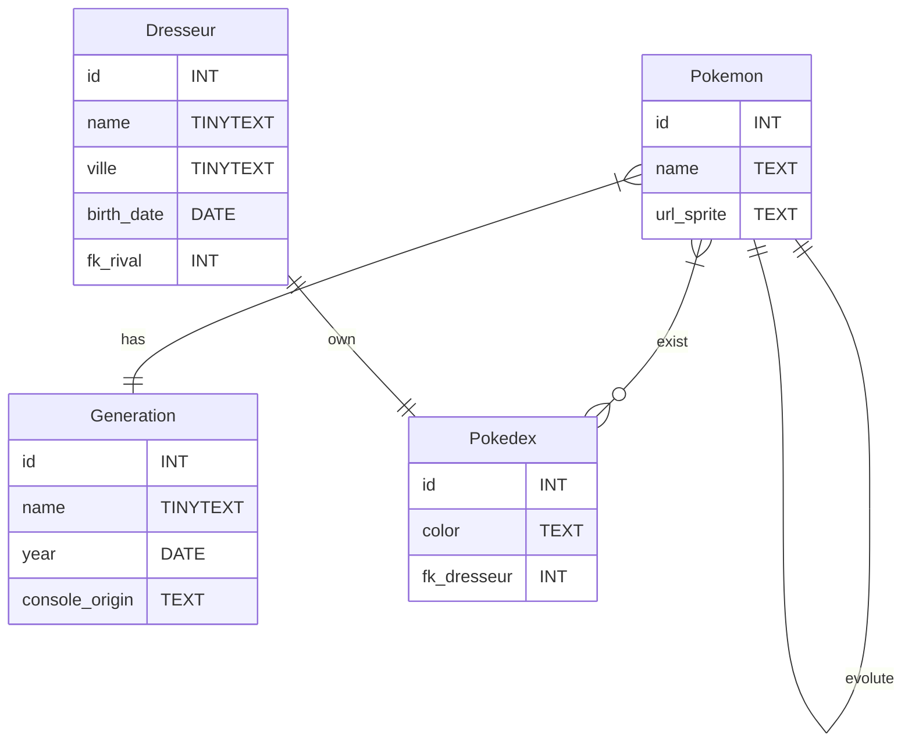

# TP Pokemon
## Le Besoin
Le client veut créer le prochain jeu *Pokemon*, vous êtes chargez de la création de la base de donnée du jeu.
*Pokemon* est un jeu video où un dresseur capture des pokemons pour les faire apparaitres dans son *Pokedex*.

Concevez les tables de données neccessaires au fonctionnement du jeu en vous basant sur les détails fournis par le client et l'entretien que vous faites avec lui (moi héhé).

## Déroulement du TP
Formez des groupes de deux, ou de trois si il y a un nombre impaire de personne. Chaque personne devra concevoir sa BDD de son coté mais vous réfléchirez ensemble au projet et passerez les entretiens avec le client ensemble également.

> **Je recommande de notez vos requêtes dans un fichier pokemon.sql sur VSCode pour ne rien perdre en cas de problème.**

### Déroulé du projet : 
1. **Lisez le TP de fond en comble** pour analyser le besoin du client. Votre rôle est d'apporter la solution technique, vous devez donc comprendre le sens du projet.
2. **Préparez des questions** pour le premier entretien avec le client.
3. **Passez l'entretien de début de projet avec le client**, votre objectif est de serner le besoin du client et de faire le lien avec vos connaissances technique pour trouver les éventuellement subtilités du projet.
4. **Développer la BDD** et contactez réguliérement le client lors des avancés du projet ou si vous avez une question.

> Le client, bien évidement, c'est moi. Mais vous pouvez tout de même me demandez de l'aide pendant le déroulement du projet.;)

> Ce projet pourra servir de base pour les projets futurs, ont peut très bien y rajouter un back-end en PHP ou Java et un front-end avec JavaScript ou AndroidStudio ou faire une application full-stack en PHP.

## Pré-requis
- MySQL et SQL
- Liaisons de tables
- Analyser le besoin d'un client

# Cahier des charges

|Tâches| Description | Contraintes |
|---|---|---|
|Dessiner le diagramme ER du jeu ||Vous pouvez utiliser mermaid et markdown pour les rédiger proprement.|
|Créer les tables SQL dans la BDD||La BDD s'appelle `pokemon`|
|Les pokemons|Les pokemons sont des petits monstres, il possède tous un nom et une image pour les representer|Les images seront stocké dans un serveur web, vous n'avez qu'à stocker un url dans la BDD SQL.|
|Les Dresseurs| Les Dresseurs sont les joueurs, il on un nom, une ville de naissance et  une date de naissance|Un Dresseur peut avoir un rival, c'est à dire un autre dresseur qui est un joueur comme lui|
|Le Pokedex|Le pokedex est une genre d'ordinateur portable qui répértorie les pokémons du dresseurs| Chaque pokedex est unique et appartient à un seul et unique dresseur.|
|Les générations de pokemon| Le client veut rajouter un peu de nostalgie dans son jeu, les générations de pokemon doivent être précisés|Une génération est la période à laquel un pokemon est sortie dans un jeu Pokemon, une génration est défini par un nom, une année de sortie et une console d'origine (GameBoy, Wii, DS, ...).
|**BONUS :** Prendre en compte les évloutions des pokémons dans la structure de votre BDD|
<!-- 
## Diagramme ER

## Diagramme ER complet pour MySQL
```mermaid
erDiagram
Pokemon}|--||Generation : has
Pokemon ||--o{ PokemonPokedex : exist
Pokedex ||--o{ PokemonPokedex : exist
Dresseur||--||Pokedex : own
Pokemon ||--||Pokemon : evolute

Pokemon{
    id INT
    name TEXT
    url_sprite TEXT
}
Pokedex{
    id INT
    color TEXT
    fk_dresseur INT
}
PokemonPokedex{
    id INT
    fk_pokemon INT
    fk_pokedex INT
}
Dresseur{
    id INT
    name TINYTEXT
    ville TINYTEXT
    birth_date DATE
    fk_rival INT
}
Generation{
    id INT
    name TINYTEXT
    year DATE
    console_origin TEXT
}
``` -->