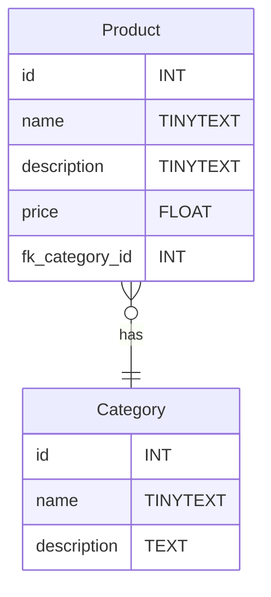

# TP shoe-shop.com Partie 1
## Le Besoin
Concevoir une base de données pour une boutique en ligne de vente de chaussures.
La boutique en ligne contient des produits qui sont classés par catégorie.
Chaque produit appartient à une catégorie.
## Pré-requis
- `CREATE DATABASE`
- `CREATE TABLE`
- `INSERT INTO`
- `SELECT  FROM`
- Liaison `One to Many`
- `PRIMARY KEY`
- `FOREIGN KEY`
# UML Diagram entity relation

# Cahier des charges

|Tâches| Description | Contraintes |
|---|---|---|
|Intégrer la table `Category`|Intégrer la table `Category` selon le diagramme d'ER||
|Intégrer la table `Product`| Intégrer la table `Product` selon le diagramme d'ER | Chaque produit doit obligatoirement avec un nom, un prix, et une catégorie |