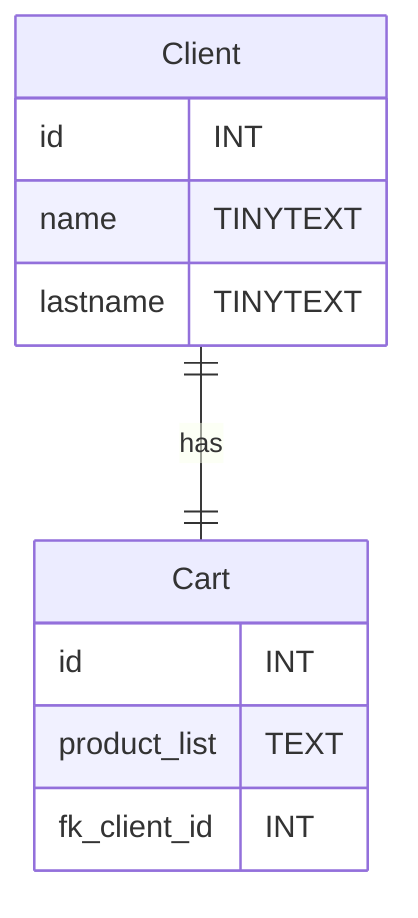

# TP shoe-shop.com Partie 2 - Client et Panier
## Le Besoin
Dans la base de donnée de shoe-shop.com il faut maintant prendre en compte les paniers des clients. Il nous faut donc une table de client et une table de panier.
**Attention, chaque client ne peut avoir qu'une seul panier et vis-versa !**
>La liste des produits est un texte contenant les clés primaire des produits séparées par des virgules, ce n'est pas l'idéal mais nous réglerons ce soucis dans la partie 3.
## Pré-requis
- Liaison `One to One`
- `CREATE TABLE`
- `INSERT INTO`
- `SELECT  FROM`
- `PRIMARY KEY`
- `FOREIGN KEY`
# UML Diagram entity relation

# Cahier des charges

|Tâches| Description | Contraintes |
|---|---|---|
|Intégrer la table `Client`|Intégrer la table `Client` selon le diagramme d'ER||
|Intégrer la table `Cart`| Intégrer la table `Cart` selon le diagramme d'ER | La liste des produits est un texte contenant les clés primaires des produits séparées par des virgules, exemple : "3,6,1,8" |