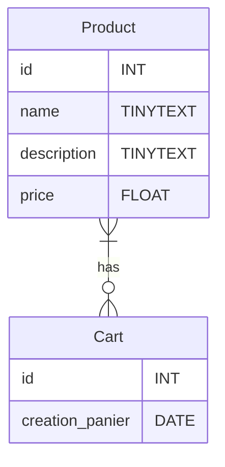

# TP shoe-shop.com Partie 3 - Panier et Produits
## Le Besoin
Malheur, notre base de donnée à une faille... :(
Lors de l'ajout de produits au panier je dois fournir une liste des clés primaires de mes produits à la table `Cart`. Seulement voilà, si une clé de la liste n'existe pas l'enregistrement fonctionne quand même !
**Il faut résoudre ce problème !**
La solution ?

**La liaison `Many to Many` !**
## Pré-requis
- Liaison `Many to Many`
- `ALTER TABLE` pour modifier une table existante.
- `INSERT INTO`
- `SELECT  FROM`
- `PRIMARY KEY`
- `FOREIGN KEY`
# UML Diagram entity relation

# Cahier des charges

|Tâches| Description | Contraintes |
|---|---|---|
|Dessiner la liaison `Many to Many`| Dessiner la liaison `Many to Many` entre la table `Product` et `Cart` en faisant apparaitre la table de jointure|Réspectez la norme de nommage du SQL pour le nom de la table de jointure(CamelCase).|
|Intégrer la table de jointure | Intégrer la table de de jointure de la liaison `Many to Many` du diagramm ER. ||