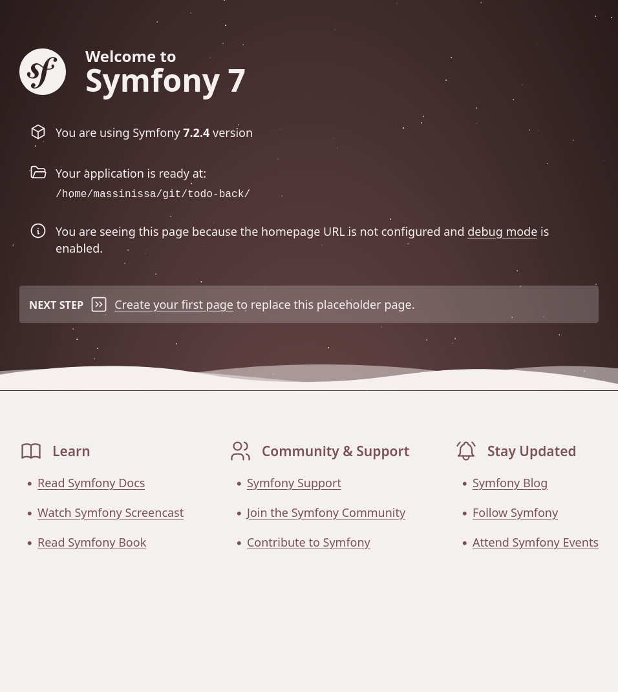
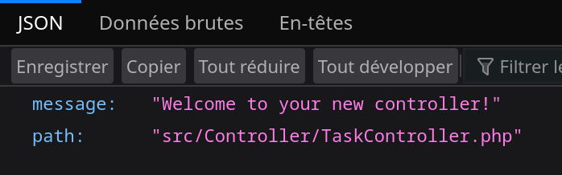
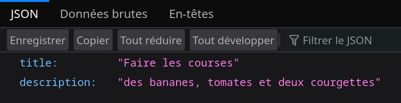

# Symfony - API REST Introduction 

Symfony est un Framework Web back end. 

## A quoi sert Symfony, les cas d'utilisation.

Il permet de créer un serveur Web http en PHP. 

Le plus souvent les applications symfony, et donc les scripts PHP, sont exécutés par un serveur http. Comme apache ou ngx.

Symfony permet de créer trois types d'applications :

- Un site Web, c'est-à-dire une application qui envoie du HTML au client et se connecte le plus souvent à une base de données. Un Site Web classique en somme.
- Une API REST, c'est-à-dire une application qui envoie des données le plus souvent au format JSON, mais également en binaire dans le cas de transfert de fichier. 

> La différence principale entre une API reste et un site Web réside dans le format des données envoyées par le serveur : un site Web, m'envoie du HTML et donc l'affichage final à l'utilisateur, alors qu'une API REST envoie des données "brutes". 

> Ces données sont destinées à des développeurs front-end qui, à partir de ces données vont fabriquer l'interfaces utilisateur pour une application application Web ou une application mobile. 

- Une application en ligne de commande CLI. 

> PHP étant une sur-couche du langage C, il possède donc tous les appels système nécessaires à la fabrication d'un programme en ligne de commande, le Framework Symfony propose donc des modules de qualité pour créer facilement des applications en ligne commande. 

## La Philosophie de Symfony

La philosophie de Symfony est la programmation modulaire, concrètement Symfony est composé de plusieurs modules utilisables indépendamment. D'après la philosophie de Symfony, il n'est pas forcément nécessaire d'utiliser l'entièreté du framework pour toutes vos applications.

Vous pouvez sélectionner uniquement les modules que vous souhaitez utiliser et dont vous avez besoin pour créer une application légère et performante.

## Objectif de ce TP.

**Nous allons creer le back-end d'une application de todo liste.**

Créer une API REST qui fournit aux clients les données contenues dans une base de données.

Concrètement il va falloir créer des points d'entrée pour notre application sous la forme du URLs appeler ***routes***.

Notre base de données contiendra les tâches d'une to-do liste. 

|id | titre | description |
|-|-|-|
|1|Faire les courses| des bananes, tomates et deux courgettes|
|2|Faire une fusée | Du sans plomp et du budget|
|...|
|19| faires des vitres | ajax vitres et un chiffon.|


Comme nous faisont une API REST, il n'est pas nécessaire de fabriquer le HTML et le Css. Le travail du développeur Backend est uniquement d'accéder à la base de données et de fournir au client les données demandées dans la réponse Http.

### Quelques exemples des routes de notre application :

- **GET /all-tasks**, cette URL renvoie un tableau de tâches au format JSON.
- **POST /new-task**, cette URL ne renvoie pas particulièrement de données, mais ajoute une nouvelle tâche dans la base de données.

## Pre-requis et Hello world 

- apt install 
- symfony-cli create new project
- symfony start server

https://symfony.com/doc/current/setup.html

### PHP 

```bash
apt update
apt install php-common libapache2-mod-php php-cli php-xml
```

### Composer

```bash
php -r "copy('https://getcomposer.org/installer', 'composer-setup.php');"
php -r "if (hash_file('sha384', 'composer-setup.php') === 'dac665fdc30fdd8ec78b38b9800061b4150413ff2e3b6f88543c636f7cd84f6db9189d43a81e5503cda447da73c7e5b6') { echo 'Installer verified'.PHP_EOL; } else { echo 'Installer corrupt'.PHP_EOL; unlink('composer-setup.php'); exit(1); }"
php composer-setup.php
php -r "unlink('composer-setup.php');"
```

```
sudo mv composer.phar /usr/local/bin/composer
```

### Symfony CLI

```
curl -1sLf 'https://dl.cloudsmith.io/public/symfony/stable/setup.deb.sh' | sudo -E bash

sudo apt install symfony-cli
```
https://symfony.com/download

## Vérifier si tout est bien installer
Pour vérifier si tout à bien été installé symfony cli offre une commande toute prête.

Tapez la commande suivante pour vérifier si vous n'avez loupé aucune étape.

```
symfony check:requirements
```

> Si le check ne passe pas appelez moi. Si il vous dit par exemple XML manquant tapez : `sudo apt install php-xml`.

### Créer un nouveau projet

Créer un projet symfony :

```bash
symfony new todo-back --version="7.2.x"
cd todo-back
``` 

Puis ouvrez le dans VSCode.

```
code .
```

### Installer make

make nous permettra d'ajouter facilement des element à notre site installé le (tapez 0):

```
composer require symfony/make-bundle --dev
```

### Lancer le server

```
symfony server:start
```

Le server écoute sur http://localhost:8000/

Rendez-vous à cette adresse sur votre navigateur web.

Vous devriez voir ceci :

*Page de démarrage d'un projet symfony*


## Le Controller - associer des url a des fonctions
Un contrôleur est une classe PHP. Elle contient plusieurs fonctions appelées méthodes.
Le principe est simple, chaque URL de mon application se voit affecter une fonction.

Par exemple, si l'utilisateur tape **/all-tasks** la fonction *getAllTasks()* s'exécutera et envera les tâches à l'utilisateur.


### Creer le controller 
https://symfony.com/doc/current/page_creation.html

1. Créer le controller TaskController

```
symfony console make:controller TaskController
```
> Appuiez sur entrer pour configurer le controller par défaut.


Symfony vous a créer un fichier *TaskController.php* dans le dossier `src/Controller`.

Le voici :

```php
<?php

namespace App\Controller;

use Symfony\Bundle\FrameworkBundle\Controller\AbstractController;
use Symfony\Component\HttpFoundation\JsonResponse;
use Symfony\Component\Routing\Attribute\Route;

final class TaskController extends AbstractController
{
    #[Route('/task', name: 'app_task')]
    public function index(): JsonResponse
    {
        return $this->json([
            'message' => 'Welcome to your new controller!',
            'path' => 'src/Controller/TaskController.php',
        ]);
    }
}
```

Ici on peut voir que la fonction `index()` *return* un tableau php au format JSON grâce à la fonction `$this->json()`.

```php
[
   'message' => 'Welcome to your new controller!',
   'path' => 'src/Controller/TaskController.php',
]
```


1. Tapez la route dans firefox : `http://localhost:8000/task`.



#### Envoyer une tache

C'est un objet qui possède des attributs message et path mais vous pouvez envoyer les données que vous souhaite.

Changer le code pour :

```php
[
   'title' => 'Faire les courses',
   'description' => 'des bananes, tomates et deux courgettes',
]
```

2. Recharger la page */task* et observez les changements.



### Renommer la route 

1. La route s'appelle `/task` renommée la `/all-task` .

```php
#[Route('/task', name: 'app_task')]
```

```
#[Route('/all-tasks', name: 'app_task')]
```

2. Et renommé la fonction `getAllTask()` pour la clarté du code

```php
<?php

namespace App\Controller;

use Symfony\Bundle\FrameworkBundle\Controller\AbstractController;
use Symfony\Component\HttpFoundation\JsonResponse;
use Symfony\Component\Routing\Attribute\Route;

final class TaskController extends AbstractController
{
    #[Route('/all-tasks', name: 'app_task')]
    public function getAllTasks(): JsonResponse
    {
        return $this->json([
            'title' => 'Faire les courses',
            'description' => 'des bananes, tomates et deux courgettes',
        ]);
    }
}
```


### POST - préparer la route d'ajout de tache

pour l'instant, notre application ne possède pas encore de base de données.

Nous allons donc simplement préparer une fonction vide; nous la remplissons de la requête d'ajout de tâche plus tard une fois notre base de données mise en place.

2. Dans la class TaskController ajouté uen


## Creer et connecter une base de données 

### Le Model - Mon objet métier, ma tâche.

Lorsque l'on crée un back-end, la première étape consiste toujours à réfléchir à la structure des données à envoyer aux clients.

Ici notre donnée est une tâche composée de deux attributs :

- un **titre**, une chaîne de caractère donc.
- une **description**, également une chaîne de caractère.

C'est tout. Sur ce TP, nous utilisons une structure de données très simple qui vous permettra de comprendre facilement les mécaniques de base du Framework symphony.

Imaginez notre future table de données comme ceci :

|id | titre | description |
|-|-|-|
|1|Faire les courses| des bananes, tomates et deux courgettes|
|2|Faire une fusée | Du sans plomp et du budget|
|...|
|19| faires des vitres | ajax vitres et un chiffon.|


### Créer le TaskModel

make model

make migration pour creer ou mettre a jour la bdd a partir de notre model.

### Le Controller - utiliser mon model 

#### GET - envoyer le contenu de ma BDD au client

#### POST - ajouter un element fournit par le client dans ma BDD

## Conclusion 

Vous savez concevoir un back-end Symfony. Vous pouvez a present le connecter à n'importe quel client qui sait communiquer en http, comme une application mobile ou en site Web codé en JavaScript par exemples.

Le framework Angular est une solution idéale pour la partie front de notre application.

En developpement web il est très courant aujourd'hui de concevoir un serveur Web sous la forme d'une API REST avec un framework backend comme Symfony(PHP) ou Spring(Java), pour ensuite le connecter à une application frontend codé avec le Framework Angular.

Voixi quelques exemples classiques de la stack des projets modernes d'entreprise :

- Angular, Symfony, docker, pipeline gitlab cicd.

– Angular, Spring, docker, pipeline gitlab cicd.

– Flutter (framework app mobile), Symfony, pipeline gitlab cicd.

- Android studio, Spring, docker, Pipeline gitlab cicd.

### temp note perso 

1. Installation des prérequis :
   ```bash
   sudo apt install php-cli unzip
   ```

2. Créer un nouveau projet Symfony :
   ```bash
   symfony new my_project_name --full
   ```

3. Démarrer le serveur Symfony :
   ```bash
   symfony server:start
   ```

4. Ajouter une route :
   ```php
   // Dans src/Controller/TaskController.php
   use Symfony\Component\Routing\Annotation\Route;

   class TaskController extends AbstractController {
       /**
        * @Route("/all-tasks", name="all_tasks")
        */
       public function allTasks() {
           // utiliser le model pour get les tasks
        
          // ensuite les sens en json
       }
   }
   ```

5. Tester une route :
   ```bash
   curl http://127.0.0.1:8000/all-tasks
   ```

6. Envoyer des données JSON (POST) :
   ```bash
   curl -X POST http://127.0.0.1:8000/new-task -H "Content-Type: application/json" -d '{"title": "New Task", "description": "Task description"}'
   ```
  > faut creer une autre finction dans le controller

7. Créer un modèle :
   ```bash
   php bin/console make:entity Task
   ```

8. Créer et exécuter une migration :
   ```bash
   php bin/console make:migration
   php bin/console doctrine:migrations:migrate
   ``` 

