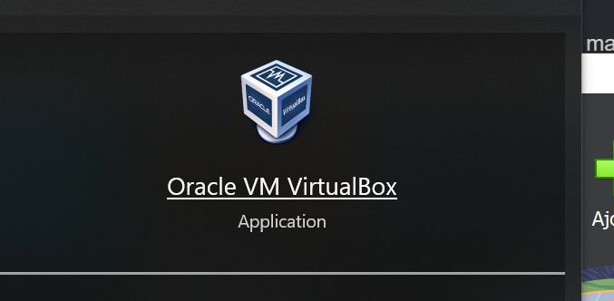
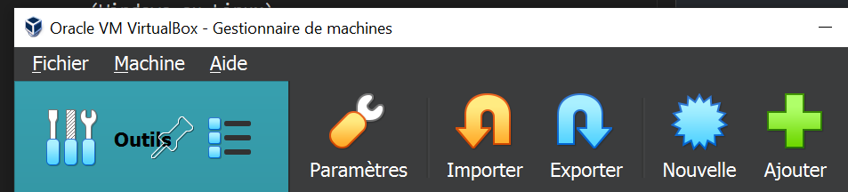

# Machine virtuel
Une machine virtuel est un programme qui simule le comportement d'un ordinateur (Entrée, Sortie,Processeur, Mémoire, Carte réseau, ...).

Les machines virtuels permettent d'avoir plusieurs systèmes d'exploitation sur un même système d'exploitation hôte.

Les programmes qui permettent la création de machine virtuel s'appelles des *Hyperviseurs*.

*VirtualBox* est un hyperviseur de type 2 c'est à dire un hypersieur installable sur un OS existant et qui va gérer les OS hébergés.

Pour créer une machine virtuel il faut :

1. Installer VirutalBox
2. Télécharger une image disque ISO d'un OS (Windows ou Linux)
3. Ajouter une nouvelle machine dans virtualbox : préciser les spécification matériel de la machine pour définir sa puissance(fréquence et nombre de processeurs, RAM, espace disque)
4. Pendant le processus de création de la VM un fichier ISO vous est demandez, fournissez lui pour qu'il lance l'installation de l'OS au démarrage de la VM.
5. Démarrer la machine et suivre les instructions d'installation de l'OS.

## Télécharger Virtual Box

//

## Télécharger une ISO 
Un fichier ISO est un fichier qui contient les données d'un CD d'installation.

ISO de windows : //

ISO de Ubuntu (GNU/Linux) : //

ISO de Debian (GNU/Linux) : //

## Activité - Créer des VM

**Lancer VirtualBox et créer une nouvelle VM.**

Utilisez le bouton *Ajouter* pour créer une VM et suivez les instructions d'installation.

N'oubliez pas de télécharger une image ISO de *Ubuntu* avant car le téléchargement peut prendre un peu de temps !

1. Créer une VM Ubuntu
2. Créer une VM Windows 10
3. Créer une VM Debian
4. Faite vous une documentation perso rédigé en *MarkDown* qui explique via des captures d'écran comment créer une VM. (Appellez moi pour que je vous explique Markdown).