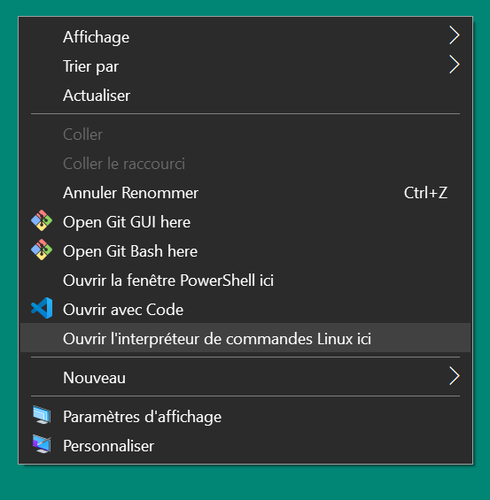

## Activité - Comment compiler son premier programme ?

### Pré-requis
Je recommande de coder en C sous linux car la plupart des logiciels codés en C tourne sous Linux ou dans un environnement UNIX.

Il est également important de vous familiarisez le plus tôt possible avec les commandes Linux pour ne pas être handicapé plus tard lors de la conception de véritable logiciel.

Il existe plusieurs moyens d'être sous Linux sans abandonner Windows : 
- Le dual-boot, installer deux OS sur le même PC.
- Un Machine Virtuel(VM) qui va émuler un ordinateur dans lequelle je peux installer Linux.
- WSL, Windows Subsystem for Linux. Qui rajoute une surcouche Linux à Windows, ce n'est pas un OS Linux au complet mais c'est suffisant pour se que nous voulons faire.

Comme première expérience je vais compiler un programme sous Windows.

## Installer WSL
Dans un PowerShell utilisez la commande *wsl* pour installer *Ubuntu* une distribution ("version") de Linux.

```bash
wsl --install -d Ubuntu
```


## Accédez à Linux avec wsl
Vous pouvez ouvrir wsl directement dans un dossier Windows spécifique. 

Dans le bureau, faite : *Shift+Clic-Droite* et séléctionnez "Ouvrir un terminal linux dans ce dossier".


### Ecrire le le code source.
Pour compiler un programme il faut d'abord l'écrire dans un fichier texte en respectant la syntaxe d'un langage de programmation.

Le texte ainsi écrit est appelé *code source*.

Voici le code source d'un programme tout simple écrit en C qui affiche "Bonjour !".
```c
#include <stdio.h>

int main(){
    printf("Bonjour !\n");
    return 0;
}
```
1. Créez un fichier nommée ***main.c*** sur le Bureau
2. Ecrivez le code source suivant dans un editeur de texte (blocnote, notepad++ ou vscode) dans le fichier main.c.
```c
#include <stdio.h>

int main(){
    printf("Bonjour, appuiez sur n'importe quelle touche pour quitter le programme!\n");
    int input;
    scanf("%d",&input);
    return 0;
}
```
3. Enregistrez ce fichier sous le nom ***main.c***

>J'affiche un message, puis je demande à l'utilisateur de tapez quelque chose (je me sert pas de l'input entrez) puis le programme fini avec le return

### Compiler le code source
Pour compiler notre code source il nous faut un compilateur.

### Installer le compilateur MinGW

*minGw* est un compilateur C pour windows. 

Installez le avec *apt* :

```bash
sudo apt-get install mingw-w64
```

> Si le paquet est introuvable mettez à jour votre système WSL avant d'installer minGw avec la commande suivante:
> ```
> sudo apt update && sudo apt upgrade
> ```

## Compiler le code source
Pour compiler le fichier vous devez être dans le dossier du fichier main.c

La commande ls, permet de lister le contenu d'un dossier.

Utilisez ls pour afficher les fichiers du répertoire courant.

```bash
ls
```

Si le fichier ne s'y trouve pas enregistrez le ou ouvrez WSL dans le bon dossier.(avec le raccourcis Shift+ClicDroit)

```bash
x86_64-w64-mingw32-gcc main.c
```

### Executer le programme
Il est temps d'éxécuter notre programme !

Double cliquez sur le fichier *a.exe* qui est apparu sur votre *Bureau*.

> Si vous voulez nommer votre programme autrement que a ajoutez le parametre -o à gcc.
>```bash
>x86_64-w64-mingw32-gcc main.c -o application
>```

# Questions
1. Si je retire la ligne scanf, que ce passe-t-il a l'execution et pourquoi ?
2. A quoi sert scanf() ?

#### **Fonctionnement d'une variable**
Une variable est un espace mémoire auquel je donne un nom.
Voyez sa comme un casier que je crée et dans lequel je mes une valeur.
```c
// %d permet d'afficher un nombre
int nombre = 10;
printf("%d\n",&nombre);
```
> *\n* est le caractère de retour à ligne

La taille de l'espace mémoire occupé par une variable varie en fonction du ***type de variable***.

Parmis les types variables les plus classique ont retrouve.

|type|syntaxe en C|taille en mémoire|
|-|-|-|
|integer|*int age = 24;*|2 octets|
|float|*float taille = 1.70;*|4 octets|
|character|*char lettre = 'h';*|1 octet|
|chaine de caractère|*char\* mot = "hello";*|1octet * le nombre de caractère (4 octets pour la chaine *hello* par exemple)|

>Une chaine de caractère est une suite de caractère stocké dans la mémoire les uns à la suite des autres.

#### **Fonctionnement de printf**
printf() signifie Print formated, car il permet d'afficher un texte dans la console et qu'il foit donc la possibilité d'y ajouter des variables à afficher avec des code de formatage.

```c
// %d permet d'afficher un nombre
int nombre = 10;
printf("%d",nombre);
```

#### **Programmation conditionnel, le fonctionnement du If**
Avec un SI (if) je peut vérifier si une chose est vrai avant d'effectuer une action.
```c
int age = 24;
// Si age est inférieur à 18
if(age < 18){
    // J'execute cette ligne
    printf("Je suis mineur");
}
if(age > 17){
    // Sinon je fais celle-ci
    printf("Je suis majeur");
}
```

#### **Fonctionnement de scanf**
*scanf* permet de demander à l'utilisateur de taper du texte au clavier.
Il prend en deuxième paramètre l'adresse d'une variable pour y stocker la valeur forunit par l'utilisateur.
```c
int nombre; // nombre est égal à ???
scanf("%d",&nombre);
// L'utilisateur tape 5
// nombre est égal à 5
```
En lanagage C l'opérateur *&* permet de récupérer l'adresse de l'espace mémoire d'une variable.
```c
int nombre = 5;
printf("%d",nombre); // AFFICHE 5
printf("%d",&nombre); // AFFICHE L'adresse de la variable
```
Passer l'adresse mémoire de la variable à scanf lui permet de modifier la variable, nous 


Ecrivez un programme,
3. Qui dit si le nombre rentré est inférieur à 100.
4. Qui affiche le carré du nombre
5. Qui demande deux nombres et affiche leurs produit.
4. Avec l'aide de scanf() et printf() essayez de coder un mini-jeu "Question pour champion !" ! :D
5. (Par équipe de 2) Inventez une idée de jeu suffisement simple pour être fait avec les outils que vous connaissez et codez le ensemble ! :)
6. Préparez ensemble un petit oral et expliquez comment vous vous y êtes pris pour faire le jeu.
