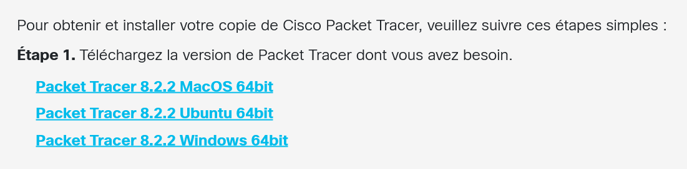

# Activité - Topologie de réseau client -serveur

Cisco Packet Tracer est un logiciel qui permet de dessiner des réseaux informatique pour tester des réseaux.

Pour l'installer, suivez le début du cours officiel Cisco pour avoir un lien de téléchargement :
https://www.netacad.com/fr/courses/getting-started-cisco-packet-tracer?courseLang=fr-FR

*Cliquez sur Commencez avec Self-Paced*

*Connectez vous*

*Télécharger la bonne version de Cisco PT*

## Les bases de Cisco
Cisco Packet Tracer est un logiciel très complet utilisé par les administrateurs Système et Réseau (TSSR). Pour apprendre les bases de CPT voir même plus suivez le cours en ligne officel : 

Vous pouvez commencer avec le Getting-Started : https://www.netacad.com/fr/courses/getting-started-cisco-packet-tracer?courseLang=fr-FR

### Questions

1. Définissez l'adresse IP de deux PCs
2. Transférez un message d'un ordinateur à un autre.
3. Créer un réseau en étoile avec un switch et 6 PCs.
4. Ajoutez un server sur le réseau
5. Ouvrez un navigateur web dans un des PC et accédez au serveur web du server en tapant son IP dans la barre de recherche.