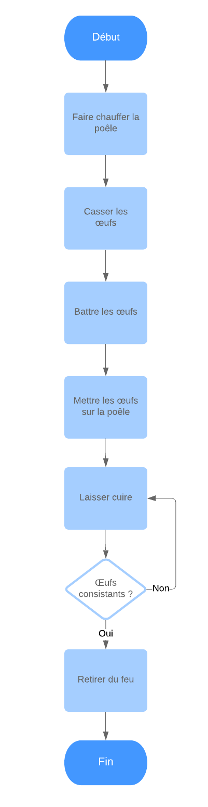
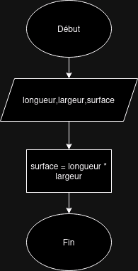
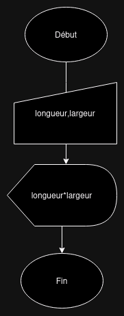
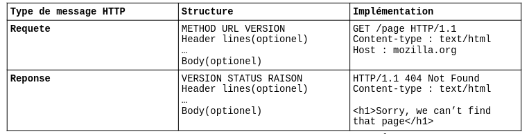

# Introduction à l'informatique

L'informatique c'est le domaine des sciences qui s'attarde aux traitement automatique d'informations via des programmes exécutés par un ordinateur.

Elle est composées de plusieurs domaines :
- La programmation pour écrire des programmes.
- Le réseau pour faire communiquer les programmes entre plusieurs ordinateurs
- Les systèmes (système d'exploitation) pour donner accès aux programmes aux ressources de l'ordinateur.


L'objectif de ce cours est d'obtenir les bases en Programmation, Système et Réseau nécessaires à tout étudiants en informatique. Une fois ces bases obtenues vous serez vous repérer dans le domaine de l'informatique et placer chaque technologie rencontrées sur la "carte" de l'informatique. Vous aurez également acquis des compétences pratique dans les principaux domaines de l'informatique (Programmation, système et réseau).


## Les données numériques

Les informations numériques traités en informatique sont représentées en binaire, une base de numération qui ne possède que deux chiffres 0 et 1, contrairement à la base 10 qui possède 10 chiffres : 0, 1, 2, 3, 4, 5, 6, 7, 8 et 9.

Au même titre que l'on peut compter une infinité de nombre avec les chiffres de la base 10 ou peut compter une infinité de nombres avec la base 2.

Les nombres en binaire sont représentés via une suite de chiffres appelés **bit**.

```
1011 = 11
```

Chaque bit possède une valeur et un état : 1 ou 0. Le premier bit à pour valeur 1 et les bits suivant sont des multiples de 2.

> Comme en décimal le chiffre de valeur là plus faible est à droite.

**Pour obtenir la valeur complète d'un nombre binaire il faut additionner la valeur de chaque bit dont l'état est à *1*.**

Prenons 4 bits,
||||||
|-|-|-|-|-|
|valeurs|8|4|2|1|
|états| 1 |0|1|1|

```
8+2+1 = 11
```

Les bits à l'état 1 ont pour valeurs : 1,2 et 8 on addition 1+2+8 ce qui donne 11. Le bit de valeur 4 est à 0 il n'est donc pas pris en compte dans l'addition.

Ici j'utilise 4 bits mais je peux utiliser autant de bits que nécessaires.

6bits par exemple,

||||||||
|-|-|-|-|-|-|-|
|valeurs|32|16|8|4|2|1|
|états| 0|1|0 |1|1|0|

```
16+4+2 = 22
```

Ou bien 8bits qui formes un octet.
||||||||||
|-|-|-|-|-|-|-|-|-|
|valeurs|128|64|32|16|8|4|2|1|
|états| 1|1|0 |1|1|0|1|1|

```
128+64+16+8+2+1 = 219
```

La valeur maximal d'un octet(8bits) est 255. Si je veux stocker un nombre plus grand il me faut plus de bits.

Un ordinateur fonctionne uniquement via des impulsions électriques. **Les transistors du processeur de calcul de l'ordinateur ne peuvent avoir que deux état ALLUME ou ETEINT, *1* ou *0*. Voilà pourquoi informations (données) d'un ordinateur sont traités en binaire.**

> Une donnée binaire ou numérique signifie la même chose; une donnée numérique est simplement une donnée représenté en base 2 comme le binaire.

L'avantage du binaire c'est qu'il permet de compter très loin avec peu de doigts. Avec seulement mes 10 doigts je peux compter jusqu'à 1023.

L'ordinateur comptes avec ses transistors comme on compte avec nos doigts, en levant ou non un doigt, en allimantant ou non un transitor.

10bits permettent de compter jusqu'à 1023; imaginez alors ce que les milliards de transistors des processeurs moderne peuvent accomplir.

> On peut facilement calculer la valeur maximum possible à un nombre *x* de bits en mettant 2 à la pussiance de *x*.
> ```
> 2^x
> ```
> Pour 2 octets soit 16bits je fais *2 puissance 16*.
> ```
> 2^16 = 65 536
> ```
> 16bits permettent donc de compter de *0 à 65 535*

## Qu'est ce qu'un ordinateur ?

Si l'on pose la question : "Qu'est ce qu'un ordinateur ?" à un utilisateur un temps soit peu experimenté, il répondrais probablement: 

"Un ordinateur est une machine qui permet de faire des traitements automatique grace à des programmes"

Et il aurait raison.

La notion d'automatisation de tâche via un processus précis ne date pas d'hier et c'est le mathématicien Alan Turing qui mit en place le premier modèle théorique d'un ordinateur.

### La machine de Turing

*Alan Turing*

Alan Turing est le père de l'informatique, il etait mathématicien et ses talent en cryptographie on sauvé la vie de million de personne lors de la 2nd Guerre Mondiale, il à également défini les fondement de l'intelligence artificielle. Il trouvera tristement la mort à l'age de 43ans par sucide après avoir subbit une castré chimiquement forcé à cause de son homosexualité qui été alors interdite.

La machine de Turing est un modèle théorique d'une machine qui permet l'automatisation du traitement de tâches via une suite d'instructions non-ambigüe.

*"Imaginez une boite noire, dans laquelle je fais passer un ruban de papier. Sur ce ruban sont écrits, ligne après ligne, des instructions que la boite éxécute dans l'ordre. De l'autre coté de la boite, un résultat est fournit."*

Voilà une machine de Turing.

Une machine qui prend des instructions en paramètre et renvoi un résultat. Un ordinateur en sommes.

L'enchainement des ses instructions dans un ordre précis ce nomme un **algorithme.**

Intéréssont nous maintenant à ce qui se trouve dans la boite noire.

### Architecture Von Neumann

Von Neumann est un ingénieur et mathématicien du milieu du XXème siècle qui,en se basant sur les travaux de Turing, défini avec ses équipes le plan du premier ordinateur numérique moderne.
Jusqu'à aujourd'hui ce plan est toujours respecté, on appel ce plan : **l'architecture Von Neumann d'un ordinateur.**


*John Von Neumann dans les dannée 1940*

Un ordinateur est un appareil éléctronique qui **effectue des calculs via des données prises en ENTREE**. Il fournit le **résultat via une SORTIE** et **possède une MEMOIRE** qui lui permet de stocker des données le temps du calcul. Il **possède également au moins un PROCESSEUR** de calcul.

Pour qu'un ordinateur soit considéré comme tel il faut au minimum qu'il respect l'architecture Van Neumann.


*Schéma moderne (1960) de l'architecture Von Neuman avec une ordinateur qui possède un ou plusieurs processeurs*

Le fonctionnement d'une machine Von Neumann se fait comme suit :
1. Les instructions du programme sont chargées dans la **mémoire** dans leurs ordres d'executions via l'**entrée**.
2. **Unité de Controle** (UC) lit les instructions dans la mémoire et les envoie au fur et à mesure à l'**Unité Arithmétique et Logique** (UAL) qui s'occupe du calcul.
3. l'UAL peut écrire ou lire des données dans la mémoire si besoin et également demander à l'UC l'instuction suivante.

Grossièrement l'**algorithme** chargé peut être :
```
ALLOUE 2 octets dans la mémoire
RELIE une variable age à ce bloc mémoire
LIRE l'entrée -> age
SI age > 17
ALORS
ECRIT "majeur" dans la sortie
```

Un ordinateurs est donc au **MINIMUM** composé de :
- Entrée
- Sortie
- Mémoire
- Unité de controle (UC)
- Unité Arithmétique et Logique (UAL)

> On l'appel UAL car les opérateurs disponible sont 
> - les opérateurs **arithmétique**  :+,-,*,/,%
> - et les opérateurs **logiques** : AND, OR, NOT

## La programmation - Pillier de l'informatique

La programmation c'est l'action de créer un programme executable par un ordinateur. 

A l'origine les premiers programmes était des cartes perforées (un trou pour *1* pas de trou pour *0*) qu'un opérateur humain passaient dans un ordinateur géant appellé *main-frame*.

Avec le temps les ordinateurs devinrent de plus en plus puissant et il nous à été possible d'écrire des programmes directement depuis un ordinateur avec un clavier et un écran qui affiche des caractères.

Le binaire étant particulièrement long et compliqué pour la rédaction d'un programme, il nous fallait une abstraction compéhensible des humains.

Un langage proche de l'anglais qui nous permetterais d'allouer de la mémoire, faire des calculs et lire des entrées(clavier,carte réseau,...), écrire sur des sorties(écran, carte réseau,...).

On appel ce langage un langage de programmation et son plus éminant représentant est le **langage C**, le langage à la base de tout les systèmes d'exploitation moderne et de la plupart des programmes qui formes la colonne vertebarale de l'informatique moderne.

### La création d'un programme - "coder"

La création d'un programme se fait en 3 étapes :
1. Ecrire du code dans un langage de programmation
2. Compiler le code en un executable binaire grâce à un compilateur.
3. Faire éxecuter l'executable (le programme) par un système d'exploitation

> L'éxectuable fabriqué par le compilateur est également appelé programme ou logiciel. Chrome, Steam, Skype et l'explorateur de fichier Windows sont tous des programmes. Et comme tout programme ils ont tous été compilés par un compilateur.


En fonction de notre système d'exploitation l'installation d'un compilateur et l'éxécution d'un programme diffère.

Même si la majorité des utilisateurs d'ordinateurs utilise Windows, aujourd'hui la plupart des programmes son executés sur des serveurs Linux et la connaissance des commandes et du système Linux est un compétences qu'un étudiant doit aborder le plus tôt possible.

### Activité - Créer son premier programme !
Si vous êtes sous Windows : Activité-compiler un programme sous Windows
 
Si vous êtes sous Linux ou MAC : Activité-compiler un programme sous Linux
> Sous Mac utilisez *brew* plutot que apt pour installer des logiciels.

### L'algorithmie ou comment concevoir un programme ?
L'algorithmie est un domaine des mathématiques qui consiste à définir, via des rêgles non-anbigüe, une procedure permettant de résoudre un problème.

Programmer c’est définir un plan, composé d’instructions que l’on exécutes les unes après les autres. Parfois le plan peut contenir de plusieurs branches de possibilités dépendantes de conditions : « Il à t-il des bouchons sur l’autoroute, si oui prenons la nationale pendant 20 kilomètres sinon prenons l’autoroute ».  Ce plan est appelée un algorithme.

Un algorithme est composées de différentes briques élémentaires qui permettent la résolution de problème.

### Briques élémentaires d'un algorithme
Un algorithme peut être représenté via une suite de pictogrammes appellée algorigramme. Voici par exemple un algorithme qui est une suite de brique *Traitement* puis une condition *SI* comme défini dans le tableau suivant.
*Algorithme de l'omellette*


> Les algorigrammes et leurs briques sont définies dans la norme ISO 5807 (sortie 1985)

|Tableau des briques d'un algorigramme|||
|-|-|-|
|Traitement|Un traitement quelconque||
|Donnée ou variable|Stocker un valeur dans un case mémoire|*Donnée quelconque, j'écrit le nom de la variable à l'interieur* |
| ENTREE (input) | demander, lire |  *Entrée manuelle de l'utilisateur( un clavier par exemple ), peut être remplacé par un Traitement comme "demander x à l'utilisateur"* |
| SORTIE (output) | écrire, afficher| *afficher(écran) peut être remplacer par un Traitement comme "afficher x à l'écran"* |
|+ - * / %| Faire des calculs arithmétiques dans des briques Traitement|  |

|Structure de controle|||
|-|-|-|
| SI ALORS SINON (*if else*) | *SI age > 17 ALORS affiche "majeur" SINON affiche "mineur"* |  |
| La boucle TANT QUE (while) | TANT QUE age < 1  FAIRE demander age |*Je demande prix à l'utilisateur, puis je le redemande en boucle TANT QUE le prix est inférieur à 0.*   |

|Opérateurs logiques| Opérateurs utilisables dans un SI ou un TANT QUE|
|-|-|
|< >|Inférieur à ou Supérieur à|
|==| Egale à|
|!=| Différent de|
|AND| ET, par exemple : *age >17 AND taille>1,60*; age est supérieur à 17 et la taille plus d'1m60 |
|OR| OU, par exemple : keyPressed == "q" OR keyPressed == "Echap"  |
|NOT,!| NOT true == false ; 20 > 10 == true ; NOT 20 > 10 == false; c'est l'opérateur d'inversion qui inverse vrai à faux et vis versa.|

Avec ces briques je peux écrire un algorithme simple qui effectue la surface d'un rectangle.


*Exemple d'algorithme, je déclare trois variables et j'effectue un traitment pour obtenir la surface.*

Grace aux pictogrammes ENTREE et SORTIE je peux demander à l'utilisateur de rentrer les longueur et largeur et lui afficher le resultat pour rendre le programme dynamique.

 
*Demander longueur et largeur à l'utilisateur puis afficher la surface*

### Exercices algorithmique
// TODO

## Le système - Pillier de l'informatique
Von Neumann est un schéma matériel d'un ordinateur. A l'origine les premiers programmeurs concevaient des programmes qui écrivaient directement dans les registres du matériel, le développement de logiciel demandait donc des compétences pointues et prenaient énormement de temps.

L'idée de concevoir un logiciel qui fournit, une bonne fois pour toute, un interface avec les ressources matériel gérmat et les premiers systèmes d'exploitation (*Operating system* ou *OS*) furent conçu.
### Schéma en couche d'un ordinateur
De nombreux systèmes virent le jour jusqu'à l'apparation *d'un système pour les réunir tous* : ce système s'appelle ***UNIX***. Il naquit en même temps que le **langage C**, dans le années 1970, des mains des légendaires : Ken Thompson (*UNIX*), Dennis Ritchie (*UNIX & C*) et Brian Kernighan (*UNIX & C*) dans les laboratoires de *Bell*.

Unix a été adopté en masse grâce à sa grande compatibilité avec la plupart des architectures d'ordinateurs de l'époque. Le langage C est né en même temps que Linux, leurs relations symbiotique fait qu'un programmeur de l'époque pouvait apprendre le C et écrire des programmes compatible avec la plupart des ordinateurs et ce sans avoir à se soucier de son architecture spécifique.

Son modèle de représentation des données et du matériel sous la forme de fichier fût une révolution et encore aujourd'hui le système UNIX sert de norme aux systèmes comme MACOS et GNU/Linux via leurs adoptions de la norme POSX, Windows restant à part.

> Le noyaux Linux sert aujourd'hui (2024) les 3,9 milliards d'utilisateur de smartphone android.

> La plupart des commandes fonctionnant sous Linux fonctionne également sous MAC : *ls, mkdir, cd*.

On peut voir sur le schéma suivant une reprsentation du fonctionnement logiciel d'un ordinateur.

D'abord le matériel (voir Architecture Von Neumann) qui ne possède aucune partie logiciel, puis un logiciel nommée Système d'exploitation.

Les fabriquant de système d'exploitation on coder en avance de nombreuses fonctionnalitées utilisable par le programmeur. On appel ses fonctions appels système, en voici un extrait :

|Les appels systèmes||||
|-|-|-|-|
|open()|ouvre ou crée un fichier|
|read()|Lit un fichier|
|write()|écrit sur un fichier|
|exec()|Execute un programme|
|kill()|Arrete un programme|

La plupart des programmeurs d'aujourd'hui ne touche jamais à ces fonctions et travail avec des langage de programmation dit "haut niveau" c'est à dire moins proche de la machine. Cependant peu importe à quel "niveau" vous travaillerez, au bon du compte, se sont forcement les appels système qui sont utilisés pour communiquer avec le matériel par l'intérmédiaire du système d'exploitation.


*Schéma du fonctionnement logiciel d'un ordinateur*

Le système d'exploitation nous fournit des fonctions comme *read()* ou *write()* pour écrire dans des fichiers ou encore *exec()* pour executer un programme. Ces fonctions sont des appels systèmes et on peut les utiliser librements dans des langages comme le Langage C par exemple.

Vous pouvez essayer de compiler ce programme, vous verrez qu'un fichier todo.txt sera crée et qu'il contiendra la chaine de caratère *"Faire les courses"*.

```c
// Inclusion des bibliotèque d'appels système
#include <unistd.h>
#include <fcntl.h>

int main(){
    // Demander à l'OS d'ouvrir le fichier todo.txt dans le disque dur 
    int fichier = open("todo.txt",O_CREAT | O_WRONLY, 0777);
    char* tache = "Faire les courses";
    // Ecrire le texte "Faire les courses" dans le fichier
    write(fichier,tache,17);
    return 0;
}
```
**Et c'est ainsi qu'un programme à accès aux ressources d'un ordinateur.**

> Dans le programme précedent,
> - O_WRONLY signifie *Open write only* : ouvrir en lecture seule.
> - O_CREAT signifie *OPEN_CREATE* : créer le fichier si il n'existe pas
> - 0777 signifie que tout les monde à le droits de lire et écrire sur le fichier
> - 17 c'est le nombres de lettre à écrire. "Faire les courses" fait 17 lettres en comptant les espaces.

# Le Réseau - Pillier de l'informatique
Nous s'avons maintenant que ordinateur est composé de matériel informatique et que la puissance de ce matériel est rendu disponible par le système d'exploitation aux différent programmes qui vivent sur l'ordinateur.

Une question reste en suspend : *Comment est ce que deux programmes executés par deux ordinateurs distinct font pour communiquer ?*

C'est à cette question que nous allons répondre dans ce chapitre.

## Qu'est ce qu'un réseau informatique
Un réseau informatique est un ensemble d'ordinateurs et de matériaux de transmissions qui permettent le transfert de donnée entre ces ordinateurs.

**Les matériaux de transmissions communs :**
|||
|-|-|
|Le cable de cuivre **RJ45 (cable Ethernet)**| *Cable Ethernet, permet la transmission filaire de donnée*|
|Le cable de **fibre optique**. Un cable composé de fibre de verre permettant une transmission de donnée plus rapide que le RJ45.| *Cable de fibre optique*|
|**Le switch**. La "multiprise" du réseau, permettant de connecter plusieurs ordinateurs ensembles| *Switch à 8 ports permettant de connecter jusqu'à 8 ordinateurs les uns aux autres*|
|**Le router**, qui **connecte un réseau local à un autre réseau**. Par exemple la box internet presente chez vous contient un router qui connecte votre réseau domestique à Internet|*Livebox de chez Orange contenant, entre-autre, un router connecté à Internet*|

### Internet, qu’est-ce-que c’est ?
Internet, c’est l’ensemble des ordinateurs (hotes) et matériels de réseau connectés les uns aux autres à travers le monde grâce au fournisseurs d’accès internet (FAI). Les matériels de réseaux sont les routeurs comme votre box internet mais également les switchs, les NAT, les serveurs, les cables.

> En France les FAI les plus connu sont : Orange, SFR ou Free par exemple.

Internet est composés d’un nombres incalculable de plus petits réseau appelés LAN ou MAN.

### Les LAN
Les LAN ou Local Area Network sont des réseaux informatique de moins de 5km. 
Parmi les LAN les plus répandu on retrouve :
- Votre domicile, il est composé de tout les appareils connectés à votre box. Votre box internet est un routeur et c’est lui qui va relier votre LAN au reste d’internet.
- Le réseau d’un lycée, il est composé de tout les ordinateurs, imprimantes et serveurs présents dans l’établissement. Là encore un routeur sera présent pour relier tout ça avec le reste d’internet.

Comprenez bien que c’est le routeur qui relie les LAN et MAN à internet.


### Les MAN
Les MAN (Metropolitan Area Network) quant à eux vont plutôt recouvrir une ville ou un grand campus universitaire. Chacun de ces MAN et LAN sont reliés à des points de mutualisations(PM) mis en place par un FAI. Ce sont dans ces PM que les techniciens Orange ou SFR viennent connectés votre ligne lorsque vous souscrivez à un abonnement internet chez une FAI.


*Point de mutualisation d’un FAI présent dans la rue.*

#### Le voyage d’un message:
Imaginons qu’un ordinateur d’un LAN A souhaite envoyer un message vers le serveur d’un LAN B. Le chemin du message donne grossièrement ceci:
1. Un message est émis par un ordinateur du LAN A.
2. Le message arrive au point de mutualisation, le FAI (Orange par exemple) prend le relais.
3. Le FAI amène le message vers un LAN B.
4. Le LAN B amène le message vers le serveur demandé par l’ordinateur du LAN A.


*Transfert d’un message par internet*

>Le chemin exact parcouru par le message entre le PM du LAN A et le PM du LAN B est inconnu car personne ne peux décrire précisément toutes les branches d’internet **voilà pourquoi on appel cela le nuage d’internet ou « cloud ».**

Vous avez maintenant connaissance du chemin parcouru par un message sur internet, seulement voilà, il existe de multiple messages différents naviguant sur Internet : 
- des pages HTML, 
- des fichiers, des flux vidéos en temps réel,
- des commandes Linux

Alors, comment reconnaître un message d’un autre ? Comment définir la forme d’un message représentant un page web ou un transfert de fichier par exemple ?

La réponse est simple **les protocoles**.

### Les protocoles de communication informatique
Un protocole de communication est un norme définissant le format d’une donnée ainsi que la manière dont elle doit être construite et lue.

L'envoi d'une donnée passe souvent par l'enchainement de plusieurs protocoles. Le HTTP est contenu dans un paquet TCP qui est contenu dans un paquet IP qui est lui même contenu dans un paquet Ethernet.Chaque protocole à son rôle et contient les informations qui permettent l'acheminement correct des données.

Les protocoles peuvent être gérés par un logiciel : la navigateur web s'occupe du HTTP ou par le matériel éléctronique directement : la carte réseau s'occupe du protocole Ethernet, le router s'occupe de la distribution des IP avec le protocole DHCP.

#### Le protocole IP (Internet Protocol)
Le IP est un protocole qui défini l'hôte **destinaire** et l'hôte **source** d'envoi d'un paquet de donnée à transmettre. Les ordinateurs communiquants sont chacun représentés par un adresse codé sur 4 octets appelée adresse IP.

Une adresse IP local (LAN) commence toujours par 192.168 la suite dépend de la configuration faite par l'administrateur du réseau.

L'adresse actuelle de mon ordinateur dans le LAN est
```
192.168.224.98
```

Vous pouvez connaitre votre adresse IP avec les commandes :

*Linux*
```bash
ip addr
```
*Windows*
```PowerShell
ipconfig
```

Ces commandes affiche deux adresse IP:
- L'adresse du *PC dans le LAN* qui commence par `192.168`, ici `192.168.1.102`. C'est à cette adresse que les autre PC du réseau peuvent envoyer des requêtes.
- L'adresse de *loopback* `127.0.0.1` l'adresse local du PC qui permet de mettre en place des services TCP/IP locaux à la machine sans être connecté à un LAN. On s'en sert beaucoup en développement web comme adresse pour un serveur web local sur le port 80.
```

1: lo: <LOOPBACK,UP,LOWER_UP> mtu 65536 qdisc noqueue state UNKNOWN group default qlen 1000
    link/loopback 00:00:00:00:00:00 brd 00:00:00:00:00:00
    inet 127.0.0.1/8 scope host lo
       valid_lft forever preferred_lft forever
       
2: wlp0s20f3: <BROADCAST,MULTICAST,UP,LOWER_UP> mtu 1500 qdisc noqueue state UP group default qlen 1000
    inet 192.168.1.102/24 brd 192.168.1.255 scope global dynamic
```

##### Ping
Ping est un programme qui utilise le protocole ICMP encapsulé dans une trame IP pour savoir si un hôte est accessible sur le réseau. 
*Cette commande permet de "pinger" un autre hôte à l'adresse 192.168.224.97*
```
ping 192.168.224.97
```
> **Attention !** Ping permet de pinger une adresse IP mais pas de spécifier le port TCP. En effet ping fait partie de la même couche réseau que IP, une couche inférieur à TCP dans le modèle OSI.

#### Le protocole TCP
Le protocole TCP est un des protocoles les plus utilisés sur Internet, il permet de créer une connection entre deux programmes situés sur des ordinateurs différents, ces programmes sont appellés sockets. Une fois la connection crée, les deux sockets sont capables de s’envoyer des messages.

Le TCP permet d'envoyer énormement de type de données et de nombreux protocole demande une connexion TCP pour envoyer des données, comme : le HTTP, le FTP ou le SSH par exemple.

La spécificité du  TCP est sa capcitié à garantir que les paquets de données soit  correctement acheminés du serveur au client. Pour chaque requête envoyer le TCP attend une réponse pour vérifier que le programme destinataire à bien reçu le paquet de donnée.

##### Service TCP
Les serveurs et clients TCP sont des programmes. Ils peuvents être codée dans des langage de programmation bas niveau comme le C par exemple. Ce programme sont appelés ***service*** ou ***deamon***.

Un service TCP est toujours relié à une adresse IP et un port.

Par exemple, par défaut, le serveur web *apache2* est relié à l'adresse IP du PC dans le LAN (192.168.x.x) et au port 80. Alors que celui de *vsftpd*(un serveur ftp) est également relié à l'adresse IP du PC dans le LAN mais cette fois ci sur le port 21.

Si chaque service est une "maison" voyez l'adresse IP comme le nom de la rue et le port comme le numéro de maison.

#### Le protocole UDP
L’UDP permet, tout comme le TCP, de créer une connection entre deux sockets à la différence que l’UDP n’a que faire de savoir si un paquet est bien arrivé; il envoie ce qu’on lui demande et ne s’en occupe plus après.

L’UDP est adapté pour des transferts des données telle que du flux vidéo en temps réel (« Twitch », « Zoom ») ou de l’audio («Whats app» par exemple ) car la perte d’une image dans une vidéo ou d’une millisecondes de son dans une piste audio n’est pas suffisament grave pour nécessiter l’utilisation plus lourde du TCP.

Le fonctionnement de l’UDP en fait un protocole très rapide.

#### Le protocole HTTP
Le protocole HTTP défini le format d’un message HTTP ainsi que la manière dont il doit être lu et construit. 

##### Client HTTP
Les navigateurs web sont des programmes qui vont construire des requêtes HTTP à partir des données écrite par l’utilisateur dans la barre de recherche. *On dit donc que le navigateur web implémente le protocole HTTP.*

##### Serveur HTTP
Le serveur possède un programme permettant de lire les requêtes HTTP provenant d’un navigateur, puis de renvoyer une réponse HTTP au navigateur. Ce programme est appelé un **"serveur web"** . *On dit donc que le serveur web implémente le protocole HTTP.*

Ces deux programmes connaissent les règles de protocole HTTP, par conséquent il peuvent communiquer ensemble.

Le protocole HTTP est plutôt connu du grand public et celui-ci est spécialisé dans l’envoi de page HTML, script CSS, script JS ou encore de donnée JSON ou XML.

Voici quelque exemples d’autre protocole de communication :
- IP ou Internet Protocol : comme vu précedement ce protocole défini l’envoi de donnée d’une source vers une destination au moyen d’adresse nommée adresse IP. Il est le protocole sur lequel pratiquement tout les autres protocoles reposes.
- FTP ou File Transfer Protocol : ce protocole défini l’échange de fichiers entre deux ordinateurs distants. Il est utilisé, par exemple, pour mettre en ligne sur un serveur un site web crée au préalable en local par un développeur.
- SSH ou Secure Shell : est un protocole qui permet d’envoyer des commandes à distances à un système d’exploitation Linux. En d’autre termes grâce à ce protocole plus besoin d’être en présence de l’ordinateur pour le contrôler. Ce protocole est obligatoire dans l’administration de serveur car ces dernier sont souvent éloignés des administrateurs et ne possèdes ni clavier, ni écran avec lesquelles interagir.

##### Structure d’une requête HTTP

> Voir la documentation RFC du protocole HTTP décrivant précisément le fonctionnement du protocole : https://datatracker.ietf.org/doc/html/rfc2616

#### Modèle OSI et Modèle TCP/IP

Chaque protocole à son rôle est le plu souvent il sont encapsulé dans un autre protocole pour un acheminé vers un autre hôte. Comment se répérer dans tout ces protocoles et savoir qui à besoin de quoi ?

Il existe deux modèles hiérachiques de représentation des protocoles :
- Le modèle OSI qui décrit tout les protocole informatique possible, leurs rôles et leurs places dans l'encapsulation.
- Le modèle TCP/IP qui est un modèle moins exostif se concentrant sur tout les protocoles basé sur le protocole TCP encapsulé dans IP.


*Le modèle OSI*


*Le modèle TCP/IP à droite*

Pour un developpeur il est plus important de connaitre le modèle TCP/IP que le modèle OSI car la plupart des applications développées aujourd'hui utilises les protocoles TCP et IP pour fonctionner.

Le modèle TCP/IP à l'avantage de rendre plus abordable la distinction des rôles de chaque protocoles.

