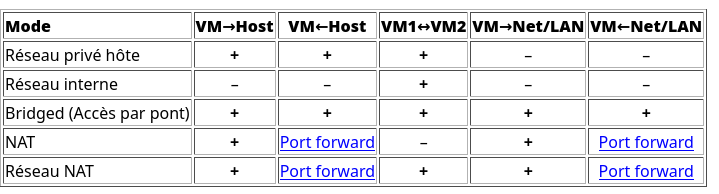

# Ping et machine virtuelle en LAN

## Effectuer un Ping 

### D'un hôte à un autre dans le même LAN
Un hôte est un ordinateur présent dans un réseau. Je peux savoir si deux ordinateurs sont présents dans le même réseau si je ping l'adresse IP de l'un depuis un terminal dans l'autre.

Pour tester la connectivité entre deux hôtes dans le même LAN, suivez ces étapes :

1. **Obtenez les adresses IP des deux hôtes** :
   - Sur chaque hôtes, ouvrez un terminal.
   - Tapez la commande suivante pour trouver l'adresse IPv4 :
     ```bash
     ip addr  # Pour Linux
     ```
     ```powershell
     ipconfig  # Pour Windows
     ```
   - Notez les adresses IP des deux hôtes.

2. **Effectuez le ping** :
   - Sur l'hôte A, ouvrez un terminal et tapez :
     ```bash
     ping <adresse_IP_hôte_B> # ex : ping 192.168.1.102 
     ```
   - Remplacez `<adresse_IP_hôte_B>` par l'adresse IP de l'hôte B. 

Vous devriez voir des paquets de données s'afficher au fûr et à mesure ainsi que le délai de transmission en millisecondes.

### **Configurez les VM** :
Pour qu'une VM puissent accéder à une autre machine (VM ou nom) il faut que les deux machines soit considérés comme dans le même réseau. VirtualBox offre des configurations pour chaque cas de figure.

- ***Ouvrez la configration d'une VM dans virtualBox (clic droit -> Configuration)***
- Dans Réseau -> mode d'accès réseau, je peux dérouler une liste des différent mode d'accès réseau.



*Par exemple si je veux faire une requête VM vers VM*, les modes correspondant sont donc tout les modes sauf NAT(le mode par défaut).

Si je veux que la connexion se fasse entre une VM et un Host j'utilise le Bridged, le NAT, le réseau NAT ou le Réseau privé hote.

Certain réseau sont plus simple à mettre en place que d'autre, par exemple le mode réseau interne neccéssite de définir statiquement les adresses IP.

***Notez tout de même que le mode Bridged fonctionne dans tout les cas***

1. **Reglez le mode d'accès réseau des deux VMs sur *Bridged*** pour permettre la communication inter-VMs.
2. **Obtenez les adresses IP des VM** :
   - Connectez-vous à chaque machines et ouvrez un terminal.
   - Tapez la commande suivante pour trouver l'adresse IP :
     ```bash
     ip a  # Pour Linux
     ipconfig  # Pour Windows
     ```
   - Notez les adresses IP des deux VMs.

3. **Effectuez le ping** :
   - Sur la VM A, ouvrez un terminal et tapez :
     ```bash
     ping <adresse_IP_VM_B>
     ```
   - Remplacez `<adresse_IP_VM_B>` par l'adresse IP de la VM B. 
   - Vous devriez voir des réponses si les deux VM sont dans le même réseau et que la connectivité est correcte.

## Activité - Connexion VM vers une autre machine
### Lisez-moi !
Les commandes à connaitre :
```bash
ip addr # permet de récupérer l'adresse ip d'une machine
ipconfig # Pour windows
ping <adresse_ip> # permet de ping une adresse ip
```

Le tableau suivant défini les modes possibles pour des connexions de VM en fonctionne du besoin. Ces modes sont paramétrable après un clic droit sur une VM : *Configuration>Réseau>mode d'accès réseau*.


*Table 6.1 de la documentation https://www.virtualbox.org/manual/ch06.html*

**Attention !** Pour certain mode de connexion il est nécessaire de créer un réseau virtuel, pour ouvrir le panneau de création des réseaux vituels faite : ***Ctrl+H*** dans VirtualBox.

### Questions :

Avec le mode de connexion de votre choix :

1. Faite fonctionner un ping d'une hôte vers hôte.
2. Faite fonctionner un ping d'une VM vers le PC hôte et vis-versa
3. Faite fonctionner un ping d'une VM vers une autre VM.
4. Faite fonctionner un ping d'une VM vers un PC du LAN et vis-versa.

*Plusieurs sont sont possibles.*