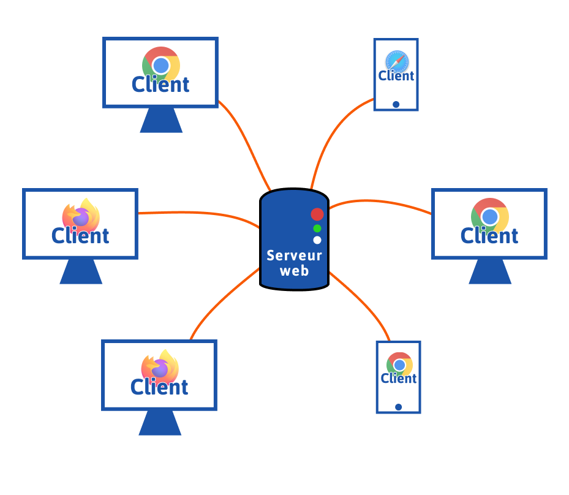
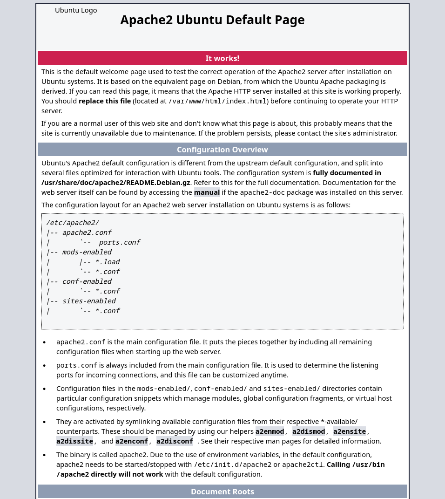

#### **Service HTTP Apache2**

##### **1. Qu'est-ce qu'un serveur HTTP ?**
Un serveur HTTP est un logiciel qui reçoit des requêtes HTTP (Hypertext Transfer Protocol) des clients, généralement des navigateurs web, et leur répond en envoyant le contenu demandé (pages web, fichiers, etc.). Il gère les requêtes entrantes et distribue le contenu en fonction de l'URL demandée. 


*Apache est l'un des serveur HTTP les plus utilisés au monde.*

##### **2. Qu'est-ce qu'un client HTTP ?**
Un client HTTP, tel qu'un navigateur web (Chrome, Firefox, etc.), est une application qui envoie des requêtes HTTP au serveur pour récupérer des ressources (pages web, images, vidéos). Le client interprète ensuite la réponse du serveur pour l'afficher à l'utilisateur final.


##### **3. Comment HTTP fonctionne : TCP/IP et le protocole HTTP**
Le protocole HTTP fonctionne au-dessus de la pile TCP/IP. Lorsqu'un client souhaite accéder à une ressource sur un serveur, il ouvre une connexion TCP avec le serveur sur le port 80 (ou 443 pour HTTPS) et écrit une requête HTTP. Le serveur traite cette requête et répond avec le contenu demandé. 

Cette communication repose sur un modèle client-serveur.


*Plusieurs client HTTP demande une ressource à un serveur web (apache)*


#### **Installer Apache2**

1. **Mise à jour du système Linux**
   ```bash
   sudo apt update && sudo apt upgrade
   ```

2. **Installation d'Apache2**
   ```bash
   sudo apt install apache2
   ```
   - Vérifier que le service Apache est en cours d'exécution :
   ```bash
   systemctl status apache2
   ```
   >- Si le service n'est pas activé lancez le avec systemctl
   >```bash
   >sudo systemctl restart apache2
   >```

#### Se rendre sur le site web
Par défaut *apache* place un site web de test dans le dossier : `/var/www/html/`.

Apache démarre le serveur HTTP sur l'ip de la machine sur le port 80.

**Rendez-vous sur un navigateur web et tapez l'ip** et le port dans la barre de recherche pour voir le site test d'apache :
```
192.168.1.102:80
```
> Remplacez l'ip par votre adresse ip.



> Le **port 80** est le port par défaut des navigateurs web, il n'est pas obligatoire de le taper après l'ip dans la barre de recherche.

#### **Mettre en production un site web**

1. **Préparez un site web**
   - Au minimum un site web est **un fichier index.html**.
2. **Déploiement du site web**
   - Autorisez l'utilisateur à modifier le dossier `/var/www/html/` puis ouvrez VSCode dans le dossier `/var/www/html/`:
   ```bash
   sudo chmod -R 777 html
   code /var/www/html
   ```

   - Remplacez tout le contenu du fichier *index.html* du site dans le dossier racine d'Apache : `/var/www/html/`.
   ```html
   <h1>Bonjour je suis un titre écrit en HTML. Copié moi dans le fichier index.html !</h1>
   ```
<!-- 
#### **Configurer Apache2**

##### **1. Changer le dossier racine du site web**
   - Modifier le fichier de configuration principal d'Apache (`/etc/apache2/sites-available/000-default.conf`).
   - Le fichier se trouve dans `/etc` qui est un dossier admin, il vous faut donc des droits sur ce dossier.
   - On peut utiliser la commande chmod mais le plus simple est de l'ouvrir avec l'editeur de texte nano.
   ```bash
   sudo nano /etc/apache2/sites-available/000-default.conf
   ```
   - Changer la directive `DocumentRoot` vers le nouveau dossier souhaité (n'importe quel dossier de votre choix, par exemple un dossier perso `/home/user/www`).
   - Redémarrer Apache :
   ```bash
   sudo systemctl restart apache2
   ```

    - Placez un fichier `index.html` contenant un peu de HTML dans le nouveau dossier `DocumentRoot` puis affichez la page web dans le navigateur. -->

<!-- ##### **2. Ajouter le HTTPS avec un certificat SSL**
   - Installer `certbot` pour générer un certificat SSL :
   ```bash
   sudo apt install certbot python3-certbot-apache
   ```
   - Utiliser `certbot` pour obtenir un certificat :
   ```bash
   sudo certbot --apache
   ```
   - Configurer Apache pour utiliser le certificat SSL. -->

### **Activité - Créer un site web**

#### Introduction succincte à HTML
Le **HTML (Hypertext Markup Language)** : Langage de balisage utilisé pour structurer le contenu des pages web.

**HTML** est le langage déscriptif utilisé pour créer des pages web. Il structure le contenu d'une page en utilisant des balises qui décrivent les éléments à afficher au navigateur.

## 1. Structure de base d'un document HTML

Un document HTML commence par une déclaration `<!DOCTYPE html>` pour indiquer au navigateur qu'il s'agit d'un document HTML5. Ensuite, les balises principales `html`, `head` et `body` sont utilisées pour structurer le document :

```html
<!DOCTYPE html>
<html>
<head>
    <title>Ma première page</title>
</head>
<body>
    <h1>Bienvenue sur ma page</h1>
    <p>Ceci est un paragraphe.</p>
</body>
</html>
```

- La balise `<html>` englobe tout le contenu de la page.
- La balise `<head>` contient les méta-informations comme le titre de l'onglet (`<title>`), des liens vers des fichiers CSS ou JavaScript, etc.
- **La balise `<body>` contient tout le contenu visible** de la page (texte, images, boutons, etc.).

### Exercice 1 :
1. Crée un fichier HTML basique avec une structure correcte et ajoute un titre à ta page dans la balise `<h1>`.

## 2. Les balises principales

### 2.1. `<p>` - Paragraphe

La balise `<p>` est utilisée pour définir un paragraphe. Elle englobe du texte et ajoute un espace avant et après le paragraphe.

```html
<p>Ceci est un paragraphe de texte.</p>
```

Attention à toujours fermer la balise avec une balise `</p>`

### Exercice 1 :
Crée trois paragraphes de texte dans le `body` sans utiliser la balise `p`. Observe comment les paragraphes ne passent pas à la ligne à chaque paragraphe.

### Exercice 2 :
Ajoute des balises `<p> </p>` autour de chaque paragraphe de texte et compare la différence avec du texte brut sans balises.

### 2.2. `<h1> - <h6>` - Titres

Les balises `<h1>` à `<h6>` définissent les niveaux de titres, du plus grand (h1) au plus petit (h6).

```html
<h1>Grand titre</h1>
<h2>Sous-titre</h2>
<h3>Section</h3>
```

- **Usage :** Utilisez `<h1>` pour le titre principal d'une page, et les autres (`<h2>`, `<h3>`, etc.) pour structurer les sous-sections.

### Exercice 1 :
Crée un titre principal en utilisant la balise `<h1>` et plusieurs sous-titres avec `<h2>` et `<h3>`.

### Exercice 2 :
Change l'ordre des balises de titre et regarde comment cela affecte la taille du texte.


### 2.3. `` - Image (balise orpheline)

La balise `` insère une image dans la page. Elle est **orpheline**, c'est-à-dire qu'elle n'a pas de balise fermante, et nécessite des attributs comme `src` (source) et `alt` (texte alternatif).

```html

```

- **`src`** : L'URL ou chemin vers l'image.
- **`alt`** : Un texte alternatif qui s'affiche si l'image ne peut pas être chargée.

Lorsque le navigateur lit l'attribut `src` de la balise `img` il effectue une requete HTTP au serveur web apache.

Il faut donc ajouter l'image `image.jpg` dans le dossier `DocumentRoot` de notre serveur web.

1. Ajouter une image dans le dossier `DocumentRoot` du serveur : par défaut `/var/www/html`.

### Exercice 1 :
Ajoute une image dans ta page HTML en utilisant l'attribut `src` pour spécifier son emplacement sur serveur.

### Exercice 2 :
Essaye d'insérer une image avec un chemin incorrect et observe comment le texte alternatif défini dans `alt` est affiché.

### Exercie 3 :

Décrivez le processus de requête échanger entre le client et le serveur depuis le chargement de la page à partir de ce source HTML.
```html
<!DOCTYPE html>
<html>
<head>
    <title>Ma première page</title>
</head>
<body>
    <h1>Bienvenue sur mon blog My'VéloBlog.com</h1>
    <p>Bienvenue !</p>
    
</body>
</html>
```
### Exercie 4 :

Décrivez le processus de requête échanger entre le client et le serveur depuis le chargement de la page à partir de ce source HTML.
```html
<!DOCTYPE html>
<html>
<head>
    <title>Ma première page</title>
</head>
<body>
    <h1>Bienvenue sur mon blog Cat'Good !</h1>
    <p>Bienvenue !</p>
    
</body>
</html>
```

### 2.4. `<a>`

La balise `<a>` crée un lien cliquable dans une page HTML.

```html
<a href="http://www.youtube.com">Cliquez-moi</a>
```

### Exercice 1 :
Crée un lien cliquable avec la balise `<a>`.

### Exercice 2 :
Ajoute plusieurs liens avec des sites différents.

### Exercice 3 :
Ajoutez un lien vers un autre fichier HTML appelé `contact.html`.

## 3. Balises orphelines

Les balises **orphelines** sont des balises qui n'ont pas de balise fermante. Voici quelques-unes des balises orphelines courantes :

- **``** : Pour les images.
- **`<br>`** : Pour insérer un saut de ligne.
- **`<hr>`** : Pour insérer une ligne horizontale.

Exemple :

```html
<p>Ceci est un texte.<br>Ceci est sur une nouvelle ligne.</p>
<hr>

```

### Exercice 1 :
Utilise la balise `<br>` pour séparer des phrases sur différentes lignes sans utiliser la balise `<p>`.

### Exercice 2 :
Ajoute une ligne horizontale à la fin de ta page avec la balise `<hr>`.


# **CSS (Cascading Style Sheets)**
Langage utilisé pour styliser le contenu HTML (couleurs, polices, mise en page, etc.).
Voici le cours rapide sur les concepts de base en **CSS** formalisé en **Markdown**, avec des exercices pratiques.

Le CSS (Cascading Style Sheets) permet de styliser des éléments HTML en contrôlant leur apparence visuelle. Nous allons explorer ici les propriétés les plus courantes comme la couleur, les bordures, le margin, le padding, et l'ombre de boîte, puis nous verrons comment utiliser Flexbox et Grid pour organiser des éléments.

## 0. Ajouter un fichier CSS
1. Dans le même dossier que `index.html` créez un fichier `style.css`.
2. Ajouter la balise link dans le head pour inclure le fichier style.css à la page.
```html
<!DOCTYPE html>
<html>
<head>
    <title>Ma première page</title>
    <link href="style.css" rel="stylesheet" />
</head>
<body>
    <h1>Bienvenue sur mon blog Cat'Good !</h1>
    <p>Bienvenue !</p>
</body>
</html>
```
## 1. Couleur

La propriété `color` permet de définir la couleur du texte, tandis que la propriété `background-color` gère la couleur de fond des éléments HTML.

```css
p {
    color: red;
}

p {
    background-color: lightblue;
}
```

Si je veux mettre un background-color sur la balise p et la balise body complete je peux :
```css
p {
    color: red;
}

p,body {
    background-color: lightblue;
}
```

> Retrouvez toute la documentation HTTML et CSS sur w2switch

### Exercice 1 :
Applique une couleur de texte rouge à un paragraphe et une couleur de fond bleu clair à un `div`.

### Exercice 2 :
Essaye d'utiliser des couleurs en utilisant les noms (`blue`, `red`), les valeurs hexadécimales (`#ff0000`) et les valeurs RGB (`rgb(255, 0, 0)`).

---

## 2. Border (Bordure)

La propriété `border` permet de définir une bordure autour d'un élément. Elle se compose de trois parties : la largeur, le style et la couleur.

```css
div {
    border: 2px solid black;
}
```

- **Largeur** : définie en pixels, em, rem, etc.
- **Style** : peut être `solid`, `dashed`, `dotted`, etc.
- **Couleur** : peut être une couleur en nom, hex, ou RGB.

### Exercice 1 :
Ajoute une bordure noire solide de 3 pixels autour d'un `div`.

### Exercice 2 :
Essaye différents styles de bordures comme `dashed` ou `dotted`.

---

## 3. Margin (Marge)

La propriété `margin` gère l'espace autour d'un élément, à l'extérieur de sa bordure. Elle peut être définie pour les quatre côtés (haut, droite, bas, gauche).

```css
div {
    margin: 20px;
}
```

- Si vous utilisez une seule valeur (`margin: 20px`), elle s'applique à tous les côtés.
- Vous pouvez spécifier chaque côté individuellement : `margin-top`, `margin-right`, `margin-bottom`, `margin-left`.

### Exercice 1 :
Applique une marge de 20 pixels autour d'un `div` et observe comment il se déplace.

### Exercice 2 :
Essaye de spécifier des marges différentes pour chaque côté du `div` (par exemple `margin: 10px 20px 30px 40px`).

---

## 4. Padding (Remplissage)

La propriété `padding` gère l'espace intérieur d'un élément, entre son contenu et sa bordure.

```css
div {
    padding: 20px;
}
```

- Comme pour `margin`, une seule valeur affecte tous les côtés, mais vous pouvez aussi définir des valeurs différentes pour chaque côté.

### Exercice 1 :
Ajoute un `padding` de 20px à un `div` et observe comment l'espace entre le contenu et la bordure change.

### Exercice 2 :
Essaye d'ajouter différents `padding` sur chaque côté (par exemple, `padding: 10px 15px 20px 25px`).

---

## 5. Ombre de boîte (Box Shadow)

La propriété `box-shadow` permet d'ajouter une ombre à un élément. Elle prend plusieurs valeurs : décalage horizontal, décalage vertical, flou, étendue, et couleur.

```css
div {
    box-shadow: 5px 5px 10px rgba(0, 0, 0, 0.5);
}
```

- **Décalage horizontal et vertical** : la position de l'ombre.
- **Flou** : le niveau de flou de l'ombre.
- **Couleur** : définie en RGB ou autre.

### Exercice 1 :
Ajoute une ombre noire douce à un `div` en utilisant `box-shadow`.

### Exercice 2 :
Modifie l'intensité du flou et de la couleur de l'ombre pour voir comment cela affecte l'apparence du `div`.

---

## 6. Utilité de la balise `<div>`

La balise `<div>` est un conteneur générique utilisé pour regrouper des éléments afin de les styliser ou de les organiser.

Voici un exemple où nous utilisons du `padding` et une `box-shadow` pour créer une carte :

```html
<div class="card">
    <h2>Carte de présentation</h2>
    <p>Ceci est une carte avec une ombre et du padding.</p>
</div>
```

```css
.card {
    background-color: white;
    padding: 20px;
    box-shadow: 2px 2px 8px rgba(0, 0, 0, 0.2);
    width: 300px;
    margin: 20px;
}
```

### Exercice 1 :
Crée une "carte" en utilisant un `div` avec du `padding`, une `box-shadow`, et un fond de couleur.

### Exercice 2 :
Ajoute plusieurs cartes avec des marges entre elles.

## 7. Flexbox (Alignement d'éléments)

Flexbox est un modèle d'organisation qui permet d'aligner facilement des éléments dans un conteneur flexible. Pour utiliser Flexbox, il faut appliquer `display: flex` à un élément parent (comme un `div`), puis utiliser des propriétés comme `flex-direction`, `align-items` et `justify-content` pour organiser les éléments.

```html
<div class="flex-container">
    <div>Élément 1</div>
    <div>Élément 2</div>
    <div>Élément 3</div>
</div>
```

```css
.flex-container {
    display: flex;
    flex-direction: row;
    justify-content: center;
    align-items: center;
    gap: 10px;
}
```

- **`display: flex`** : Définit le conteneur comme un flexbox.
- **`flex-direction`** : Définit l'orientation (`row` pour une ligne, `column` pour une colonne).
- **`justify-content`** : Gère l'alignement horizontal des éléments.
- **`align-items`** : Gère l'alignement vertical des éléments.

### Exercice 1 :
Crée un conteneur flex avec trois `div` à l'intérieur et aligne-les horizontalement au centre.

### Exercice 2 :
Essaye de changer la direction du `flex` en utilisant `flex-direction: column` pour organiser les éléments verticalement.

---

## 8. Grid (Grille)

Le modèle de grille CSS permet d'organiser des éléments sous forme de tableau. Voici comment utiliser `display: grid` et `grid-template-columns` pour créer une grille simple.

```html
<div class="grid-container">
    <div>Élément 1</div>
    <div>Élément 2</div>
    <div>Élément 3</div>
    <div>Élément 4</div>
</div>
```

```css
.grid-container {
    display: grid;
    grid-template-columns: 1fr 1fr;
    gap: 10px;
}
```

- **`display: grid`** : Définit le conteneur comme une grille.
- **`grid-template-columns`** : Définit le nombre et la taille des colonnes (ici, deux colonnes de taille égale).
- **`gap`** : Définit l'espacement entre les éléments.

### Exercice 1 :
Crée une grille avec quatre éléments, organisés en deux colonnes.

### Exercice 2 :
Change la taille des colonnes en utilisant des unités telles que `fr` (fraction) ou des pixels.

---

## Conclusion

En combinant des propriétés CSS comme les couleurs, les bordures, le padding, et les ombres, vous pouvez créer des éléments visuellement attractifs. Les modèles Flexbox et Grid sont des outils puissants pour organiser les éléments sur une page, avec Flexbox pour l'alignement et Grid pour des mises en page complexes en colonnes.

# 2. Petit Projet :
1. Créer un petit site en HTML CSS
2. Mettez le en production sur votre serveur web.
3. Vérifier qu'il soit disponible sur tout les PC du LAN de l'école. *(Attention au Bridged de la VM serveur)*.
